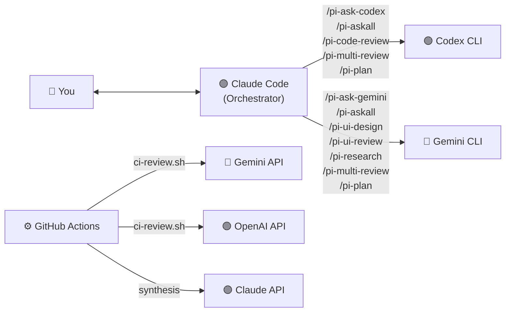
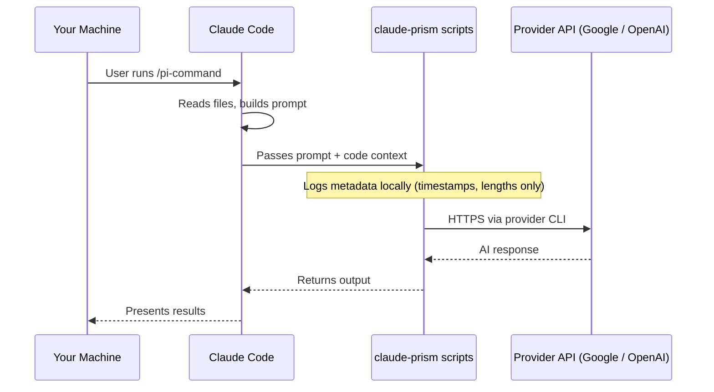

# claude-prism

<p align="center">
  
</p>

[](https://www.npmjs.com/package/claud-prism-aireview)
[](https://github.com/tznthou/homebrew-claude-prism)
[](https://opensource.org/licenses/MIT)
[](https://www.gnu.org/software/bash/)
[](https://claude.com/claude-code)
[](https://www.shellcheck.net/)

[繁體中文](README.zh-TW.md)

Cross-provider AI orchestration for Claude Code — eliminate same-source blind spots.

---

## Core Concept

### The Problem

When Claude Code writes your code **and** reviews it, you get same-source blind spots. It's like grading your own exam — certain classes of bugs, design flaws, and security issues consistently slip through because the same model has the same knowledge gaps.

Even multi-agent review within a single provider doesn't solve this: four Claude agents still share the same training data, the same architectural biases, and the same knowledge cutoff. More agents ≠ more perspectives — if the base model has a blind spot, spawning more instances of it won't find the bug.

### The Solution

Use Claude Code as the **orchestrator**, but dispatch review and research tasks to **Gemini** and **Codex** via their CLIs. Three different AI providers, three different training datasets, three different perspectives. This is **cross-provider review orchestration** — structurally different from same-source multi-agent review.

### Why claude-prism?

| | claude-prism | Single-provider multi-agent review |
|---|---|---|
| **Provider diversity** | Codex + Gemini + Claude (3 independent models) | Multiple agents, same underlying model |
| **Blind spot coverage** | Cross-training-data: each model catches what others miss | Same training data bias amplified across agents |
| **Cost** | Near-zero (Codex CLI + Gemini CLI free tiers) | $15–25 per PR (official tools, Team/Enterprise plans) |
| **Speed** | 1–2 minutes | ~20 minutes |
| **Availability** | Anyone with CLI access | Paid team plans only |
| **Scoring transparency** | [Open spec](spec/confidence-scoring-v1.md), deterministic, model-agnostic | Black-box confidence scoring |

---

## Commands

| Command | Provider | Description |
|---------|----------|-------------|
| `/pi-ask-codex` | Codex | Direct Q&A — get OpenAI's perspective |
| `/pi-ask-gemini` | Gemini | Direct Q&A — get Google's perspective |
| `/pi-askall` | Codex + Gemini + Claude | Ask all providers the same question — three perspectives with synthesis |
| `/pi-code-review` | Codex | Cross-provider code review (with confidence scoring) |
| `/pi-ui-design` | Gemini | HTML mockup from design spec |
| `/pi-ui-review` | Gemini | UI/UX accessibility & design audit (with confidence scoring) |
| `/pi-research` | Gemini | Structured technical research |
| `/pi-multi-review` | Codex + Gemini + Claude | Triple-provider adversarial review (smart routing + confidence scoring) |
| `/pi-plan` | Codex + Gemini + Claude | Multi-provider implementation planning for architectural decisions |

All commands include **graceful degradation** — if a provider is unavailable, Claude continues with the remaining providers instead of failing.

### `/pi-ask-codex` — Ask OpenAI

Direct Q&A with Codex. Good for getting a second opinion on any technical question.

```
/pi-ask-codex What's the best way to handle optimistic updates in React Query v5?
```

### `/pi-ask-gemini` — Ask Google

Direct Q&A with Gemini. Leverages Google's broad ecosystem knowledge.

```
/pi-ask-gemini Compare Bun vs Deno vs Node.js for a new backend project in 2026
```

### `/pi-askall` — Ask All Providers

Ask Codex and Gemini the same question in parallel, then Claude synthesizes all three perspectives. Works with **any topic** — not limited to code. Each provider responds independently (no cross-contamination), then Claude compares consensus, flags divergence, and delivers an integrated take.

```
/pi-askall Should we use a monorepo or polyrepo for the new microservices?
/pi-askall What's the best approach for real-time sync in a collaborative editor?
```

### `/pi-code-review` — Cross-Provider Code Review

Codex reviews code that Claude wrote. The core use case — **different AI, different blind spots**.

Each issue is scored 0–100 using the [Confidence Scoring Framework](spec/confidence-scoring-v1.md) — evidence-based, deterministic noise filtering. Only issues scoring ≥ 80 are shown. Reviews also check inline annotation compliance (`IMPORTANT`/`WARNING`/`TODO` comments) and, in `--pr` mode, surface recurring issues from historical PR comments on the same files.

```
/pi-code-review                    # review staged changes
/pi-code-review src/auth.ts        # review specific file
/pi-code-review --diff             # review unstaged changes
/pi-code-review --pr               # review entire PR
```

### `/pi-ui-design` — HTML Mockup from Design Spec

Gemini reads a design specification and generates a self-contained HTML mockup (Tailwind CDN) you can preview in a browser. Confirm the design visually, then let Claude Code implement it into your project.

```
/pi-ui-design design-spec.md              # generate HTML mockup from design spec
/pi-ui-design "a SaaS dashboard"          # no spec → Gemini drafts spec first, then mockup
```

### `/pi-ui-review` — UI/UX Audit

Gemini reviews frontend code for accessibility, responsive design, component structure, and UX patterns. Issues are confidence-scored with UI-specific factors (WCAG citations, user impact descriptions). Guideline compliance is checked if `CLAUDE.md` or `Agents.md` exists.

```
/pi-ui-review src/components/Header.tsx
/pi-ui-review src/app/(public)/
/pi-ui-review --screenshot ./screenshot.png   # uses Claude's vision instead
```

### `/pi-research` — Technical Research

Gemini conducts structured technical research with comparison tables, recommendations, and resource links. If the topic relates to the current project, relevant context (dependencies, existing patterns) is automatically included. Results can optionally be saved to `.claude/pi-research/` for future reference.

```
/pi-research Best authentication libraries for Next.js App Router
/pi-research Monorepo tooling: Turborepo vs Nx vs Moon
```

### `/pi-multi-review` — Triple-Provider Adversarial Review

The flagship command. Sends the same code to **both** Codex and Gemini in parallel, then Claude synthesizes:

1. **Consensus** — issues both providers flagged (high confidence, fix first)
2. **Divergence** — issues only one found (Claude judges validity)
3. **Guideline compliance** — violations of `CLAUDE.md` / `Agents.md` project rules
4. **Claude supplement** — issues neither caught

**Confidence Scoring** ([spec](spec/confidence-scoring-v1.md)): Every issue from all providers is scored 0–100 based on evidence quality — not Claude's opinion. Only issues ≥ 80 make it to the output. Base score 40, with evidence-based factors: specific line numbers (+25), code introduced in this diff (+25), cited rules (+20), reproducible scenario (+15), multi-provider consensus (+20). Noise signals reduce the score: subjective style (-25), linter-catchable (-25), hallucinated references (-50). The framework is deterministic, model-agnostic, and [independently reusable](spec/confidence-scoring-v1.md).

**Smart Routing** (v0.7.0): Automatically detects the domain of changes (frontend/backend/fullstack) from file extensions and paths. During synthesis, the domain-authoritative provider gets higher weight — Gemini for frontend (UI/UX expertise), Codex for backend (security/algorithm expertise). Both providers are always called; weighting only affects how Claude resolves disagreements.

```
/pi-multi-review                   # review staged changes
/pi-multi-review --pr              # review entire PR
```

### `/pi-plan` — Multi-Provider Implementation Planning

For tasks with **multiple viable approaches** — architectural decisions, tech stack selection, migration strategies. Consults Codex and Gemini for independent architectural analysis, then Claude synthesizes into a structured plan file.

Plans are saved to `.claude/pi-plans/` and include: context, multi-provider analysis, step-by-step implementation, key files, risks, and verification criteria. Plans persist across sessions.

Best for complex decisions; for simple task breakdown, use Claude Code's built-in plan mode instead.

```
/pi-plan Migrate from REST to GraphQL — evaluate Apollo vs Relay vs urql
/pi-plan Refactor the payment module to support multiple providers
```

---

## Architecture



### How It Works

1. User types a slash command in Claude Code (e.g., `/pi-code-review src/auth.ts`)
2. Claude Code reads the command definition (Markdown with instructions)
3. Claude reads the relevant code, builds a prompt
4. Claude calls the shell script via Bash tool → script invokes the external CLI
5. External AI processes the request and returns results
6. Claude presents the results, adding its own perspective where relevant
7. For review commands, structured insights are logged to `review-insights.jsonl` for trend analysis

For details on what data crosses trust boundaries, see [Privacy & Data Flow](#privacy--data-flow).

---

## Tech Stack

| Technology | Purpose | Notes |
|------------|---------|-------|
| Bash | CLI wrapper scripts | Handles binary detection, logging, stdin piping |
| Markdown | Slash command definitions | Claude Code reads these as instructions |
| Claude Code | Orchestrator | Reads commands, dispatches to external CLIs |
| Codex CLI | OpenAI access | Code review and Q&A (model configurable) |
| Gemini CLI | Google access | Research, UI review, Q&A (model configurable) |
| GitHub Actions | CI/CD integration | Automated PR review via REST APIs |

---

## Quick Start

### Prerequisites

| Tool | Required | Install |
|------|----------|---------|
| [Claude Code](https://claude.com/claude-code) | Yes | `npm install -g @anthropic-ai/claude-code` |
| [Gemini CLI](https://github.com/google-gemini/gemini-cli) | For Gemini commands | `npm install -g @google/gemini-cli` |
| [Codex CLI](https://github.com/openai/codex) | For Codex commands | `npm install -g @openai/codex` |

### Install

**Quick install (recommended)**

```bash
npx claud-prism-aireview
```

**Homebrew (macOS)**

```bash
brew tap tznthou/claude-prism
brew install claud-prism-aireview
```

**Manual**

```bash
git clone https://github.com/tznthou/claude-prism.git
cd claude-prism
./install.sh
```

The installer:
- Checks for prerequisites and reports what's available
- Verifies file integrity via SHA256 checksums (if `checksums.sha256` is present)
- Backs up any existing files before overwriting
- Copies commands to `~/.claude/commands/` and scripts to `~/.claude/scripts/`

### Verify

```bash
./tests/smoke-test.sh
```

### Uninstall

```bash
npx claud-prism-aireview --uninstall
# or manually:
./uninstall.sh
```

---

## Project Structure

```
claude-prism/
├── .github/workflows/
│   ├── ai-review.yml           # GitHub Actions workflow for CI review
│   └── shellcheck.yml          # ShellCheck static analysis for shell scripts
├── spec/                       # Standalone specifications
│   └── confidence-scoring-v1.md  # Evidence-based noise filtering framework
├── commands/                   # Slash command definitions (Markdown)
│   ├── pi-ask-codex.md
│   ├── pi-ask-gemini.md
│   ├── pi-askall.md
│   ├── pi-code-review.md
│   ├── pi-multi-review.md
│   ├── pi-plan.md
│   ├── pi-research.md
│   ├── pi-ui-design.md
│   └── pi-ui-review.md
├── scripts/                    # CLI wrappers & utilities (Bash)
│   ├── call-codex.sh           # Codex CLI wrapper
│   ├── call-gemini.sh          # Gemini CLI wrapper
│   ├── detect-domain.sh        # Domain detection for smart routing
│   ├── ci-review.sh            # CI/CD review orchestrator (curl APIs)
│   ├── usage-summary.sh        # API usage statistics
│   └── review-insights.sh      # Review pattern analysis
├── tests/
│   └── smoke-test.sh
├── checksums.sha256            # SHA256 checksums for integrity verification
├── install.sh
├── uninstall.sh
├── README.md
└── README.zh-TW.md
```

Installed to:

```
~/.claude/
├── commands/                   # ← command definitions copied here
├── scripts/                    # ← wrapper scripts copied here
└── logs/
    ├── multi-ai.log            # Call logs (timestamps, prompt/response lengths)
    └── review-insights.jsonl   # Structured review history (auto-recorded)

# Created at runtime by /pi-plan and /pi-research:
.claude/pi-plans/               # ← plan files (project-local, cross-session)
.claude/pi-research/            # ← saved research results (optional)
```

---

## Configuration

### Environment Variables

| Variable | Default | Description |
|----------|---------|-------------|
| `GEMINI_MODEL` | (CLI default) | Override Gemini model (e.g. `gemini-3-pro-preview`) |
| `CODEX_MODEL` | (CLI default) | Override Codex model (e.g. `gpt-5.3-codex`) |
| `GEMINI_BIN` | (auto-detect) | Path to gemini binary |
| `CODEX_BIN` | (auto-detect) | Path to codex binary |
| `MULTI_AI_LOG_DIR` | `~/.claude/logs` | Log directory |

By default, scripts defer to each CLI's built-in default model — no configuration needed. As CLIs update, you automatically get the latest model. To pin a specific model:

```bash
# Shell profile (~/.zshrc or ~/.bashrc)
export GEMINI_MODEL="gemini-3-pro-preview"
export CODEX_MODEL="gpt-5.3-codex"

# Or per-invocation via the -m flag
~/.claude/scripts/call-gemini.sh -m gemini-3-flash-preview "your prompt"
```

### Script Features

Both wrapper scripts support:

| Feature | Description |
|---------|-------------|
| **Binary detection** | Searches multiple paths for the CLI binary |
| **Logging** | Every call logged to `~/.claude/logs/multi-ai.log` with timestamps |
| **`--dry-run`** | Test without calling the API (no tokens consumed) |
| **Stdin piping** | `echo "code" \| call-gemini.sh "prompt"` for long inputs |
| **Model override** | `-m model-name` to use a different model |

### Customization

**Adding a new provider:**

1. Create `scripts/call-newprovider.sh` following the pattern of existing scripts
2. Create `commands/ask-newprovider.md` with the command definition
3. Run `./install.sh` to deploy

**Changing the review prompt:**

Edit the command `.md` files in `commands/`. The prompt templates are inline and easy to modify.

**Changing the output language:**

The command prompts default to English. To get responses in Traditional Chinese:

```diff
- "You are a Senior Code Reviewer. Review the following code."
+ "You are a Senior Code Reviewer. Review the following code. Respond in Traditional Chinese (繁體中文)."
```

---

## Observability

### Usage Summary

Track API call volume and estimated token consumption:

```bash
~/.claude/scripts/usage-summary.sh            # today
~/.claude/scripts/usage-summary.sh --week      # last 7 days
~/.claude/scripts/usage-summary.sh --all       # all time
~/.claude/scripts/usage-summary.sh --date 2026-02-24  # specific date
```

Output includes per-provider call counts, success/error/dry-run breakdown, and a rough token estimate (~4 chars/token).

### Review Insights

After each `/pi-code-review` or `/pi-multi-review`, Claude automatically records structured issue data to `~/.claude/logs/review-insights.jsonl`. Analyze patterns over time:

```bash
~/.claude/scripts/review-insights.sh              # full analysis
~/.claude/scripts/review-insights.sh --recent 10  # last 10 reviews
~/.claude/scripts/review-insights.sh --project my-app  # filter by project
```

Output includes:
- **Category distribution** — security, performance, design, logic, etc. (with bar chart)
- **Severity breakdown** — critical / medium / suggestion
- **Discovery source** — consensus vs. single-provider findings
- **Most frequent issues** — recurring patterns highlighted
- **Recent review timeline** — last 5 reviews with issue counts

Each review record follows this schema:

```json
{
  "date": "2026-02-24T10:30:00Z",
  "project": "my-app",
  "scope": "pr",
  "domain": "backend",
  "providers": ["codex", "gemini", "claude"],
  "issues": [
    {
      "category": "security",
      "severity": "critical",
      "confidence": 95,
      "title": "SQL injection in user input handler",
      "source": "consensus"
    }
  ]
}
```

Categories: `security`, `performance`, `design`, `logic`, `maintainability`, `guideline`, `accessibility`, `other`. The `guideline` category tracks violations of project-specific rules (`CLAUDE.md` / `Agents.md`).

---

## CI/CD Integration

Automate multi-provider reviews on every PR via GitHub Actions. The CI path uses REST APIs directly (no CLI installation needed on runners).

### Quick Setup

1. Copy the workflow file to your project:

```bash
mkdir -p .github/workflows
cp path/to/claude-prism/.github/workflows/ai-review.yml .github/workflows/
cp path/to/claude-prism/scripts/ci-review.sh scripts/
```

2. Add API keys as GitHub Secrets (at least one required):

| Secret | Provider | Required? |
|--------|----------|-----------|
| `GEMINI_API_KEY` | Gemini review | Optional |
| `OPENAI_API_KEY` | OpenAI review | Optional |
| `ANTHROPIC_API_KEY` | Claude synthesis | Optional |

3. Add the `ai-review` label to a PR to trigger the review.

### Trigger Modes

**Label trigger (default):** Add `ai-review` label to a PR → workflow runs. Best for cost control.

**Auto trigger:** Uncomment the `pull_request: [opened, synchronize]` block in the workflow file → runs on every PR update.

### How It Works (CI)

1. GitHub Actions checks out the PR and fetches the diff
2. `ci-review.sh` auto-discovers `CLAUDE.md` / `Agents.md` for guideline context
3. Historical PR comments on the same files are queried via GraphQL (single API call) and included as recurring-issue context
4. Diff is sent to available providers (Gemini API, OpenAI API) in parallel, with inline annotation compliance checks and false-positive exclusion rules
5. If `ANTHROPIC_API_KEY` is set, Claude synthesizes with confidence scoring (only issues ≥ 80 posted)
6. If not, results are concatenated directly
7. If the review includes concrete code fixes, they are posted as **inline PR review comments** with GitHub suggestion blocks (one-click accept). Remaining output is posted as the review body. Falls back to a regular PR comment if the Reviews API is unavailable

### CI Environment Variables

| Variable | Default | Description |
|----------|---------|-------------|
| `GEMINI_MODEL` | `gemini-2.0-flash` | Gemini model for CI review |
| `OPENAI_MODEL` | `gpt-4o` | OpenAI model for CI review |
| `ANTHROPIC_MODEL` | `claude-sonnet-4-20250514` | Claude model for synthesis |
| `MAX_DIFF_CHARS` | `32000` | Diff truncation limit |

### Security Notes

- **Fork PRs**: The workflow uses `pull_request` (not `pull_request_target`), so fork PRs cannot access your secrets. This is intentional — fork PRs are skipped.
- **API keys**: Use GitHub repository secrets. Never commit API keys to the repo.
- **Concurrency**: Only one review runs per PR at a time; new pushes cancel in-progress reviews.
- **Checksums**: `checksums.sha256` verifies file integrity against transit corruption or accidental modification. It does **not** protect against a compromised repository — for that, verify against the GitHub Release artifacts page.

### CLI Version Compatibility

The wrapper scripts depend on specific CLI behaviors that are not part of official stable APIs:

| CLI | Behavior Used | Verified Range |
|-----|---------------|----------------|
| Gemini CLI | `-p " "` headless mode (stdin + prompt) | v0.1.x – v0.3.x |
| Codex CLI | `codex exec - ` stdin mode | v0.100.x – v0.106.x |

If a CLI update breaks functionality, pin the working version or open an issue.

---

## Cost Estimation

claude-prism is a local wrapper — it does not process or bill tokens itself. Each command may trigger one or more API calls to external providers (Codex, Gemini) via their CLIs. Claude Code's own orchestration tokens (reading files, building prompts, synthesizing results) are separate and covered by your Claude subscription or API plan.

### Token Consumption by Command

| Command | External Calls | Typical Input Tokens | Typical Output Tokens | Notes |
|---------|---------------|---------------------|----------------------|-------|
| `/pi-ask-codex` | 1 (Codex) | 500–2K | 500–2K | Scales with question complexity |
| `/pi-ask-gemini` | 1 (Gemini) | 500–2K | 500–2K | Scales with question complexity |
| `/pi-askall` | 2 (Codex + Gemini) | 500–2K each | 500–2K each | Both providers called in parallel |
| `/pi-code-review` | 1 (Codex) | 2K–10K | 1K–4K | Scales with diff size |
| `/pi-ui-review` | 1 (Gemini) | 2K–10K | 1K–4K | Scales with file count |
| `/pi-ui-design` | 1 (Gemini) | 1K–3K | 3K–8K | Output-heavy (HTML generation) |
| `/pi-research` | 1 (Gemini) | 1K–3K | 2K–6K | Output-heavy (structured report) |
| `/pi-multi-review` | 2 (Codex + Gemini) | Above ×2 | Above ×2 | Both providers called in parallel |
| `/pi-plan` | 0–2 (optional) | 1K–5K each | 1K–4K each | Providers consulted only if available |
Token ranges are approximate and vary with input size (diff length, file count, question complexity). Different providers use different tokenization methods — these figures are order-of-magnitude estimates, not billing-accurate counts.

### Controlling Costs

- **`--dry-run`** — test the request path without calling the provider (no tokens consumed)
- **`usage-summary.sh`** — review historical call counts and rough token volume:
  ```bash
  ~/.claude/scripts/usage-summary.sh --week
  ```
- **Provider pricing** — check current rates at your provider's pricing page:
  - [OpenAI API Pricing](https://openai.com/api/pricing/)
  - [Google AI Pricing](https://ai.google.dev/pricing)

---

## Privacy & Data Flow

claude-prism is a local Bash wrapper, not a hosted proxy or relay service. There is no intermediary server between your machine and the AI providers.

### Data Flow



### What Gets Sent to External Providers

- Code snippets, diffs, or file contents relevant to your command
- The prompt assembled by Claude Code (review instructions, context)
- Model selection metadata (model name, flags)

### What Stays Local

- **Logs**: `~/.claude/logs/multi-ai.log` records metadata only (timestamps, prompt/response byte lengths) — no code content
- **Review history**: `~/.claude/logs/review-insights.jsonl` contains structured issue summaries (category, severity, confidence scores) — may include issue titles derived from AI responses
- **Plans and research**: `.claude/pi-plans/` and `.claude/pi-research/` files stay on your machine
- **No telemetry**: claude-prism has no analytics, no phone-home, no intermediary server

### What We Don't Control

Each provider's data handling is governed by their own API/business terms, not by claude-prism:

- **Data retention** — whether and how long providers store your prompts/responses
- **Model training** — whether your data is used to improve their models (API terms typically exclude this, but verify your specific tier)
- **Sub-processors** — the cloud infrastructure providers use (AWS, Google Cloud, Azure)

Provider terms:
- [Anthropic Commercial Terms](https://www.anthropic.com/policies/commercial-terms)
- [OpenAI API Terms](https://openai.com/policies/row-terms-of-use/)
- [Google AI Terms](https://ai.google.dev/gemini-api/terms)

> **For regulated or confidential projects**: If your codebase is subject to HIPAA, SOC 2, NDA, or similar compliance requirements, verify the full chain — Claude Code terms, provider API terms, data retention settings, and your organization's internal approval process — before sending code to external APIs.

---

## FAQ

**Q: Does Claude actually call the external CLIs, or does it fake the results?**

With logging enabled (default), check `~/.claude/logs/multi-ai.log` to verify. Each call is timestamped with model name and prompt/response length.

**Q: What if I only have Gemini CLI installed?**

That's fine. All commands include graceful degradation — if a provider is unavailable, Claude continues with the remaining providers. `/pi-multi-review` and `/pi-askall` will use Claude + the available provider (two perspectives instead of three). `/pi-code-review` will fall back to a Claude-only review with a caveat note.

**Q: What if a provider returns an unexpected format?**

Claude handles it. If Codex or Gemini doesn't follow the requested emoji/score format, Claude extracts actionable insights from the raw text using semantic matching rather than format parsing. Scores show "—" in the comparison table when not provided.

**Q: How much does this cost?**

See the [Cost Estimation](#cost-estimation) section for per-command token consumption ranges and cost control tools.

**Q: Can I use this with other Claude Code setups?**

Yes. The commands and scripts are standalone — they only depend on `~/.claude/` directory conventions that Claude Code uses.

---

## Reflections

In the age of AI-assisted coding, most developers have access to the "big three" CLIs: Claude, Codex, and Gemini. After subscribing to Claude Code, I kept thinking: since I already have a powerful orchestrator at hand, why not leverage other providers' CLIs at the same time? Whether it's code review, technical research, or UI/UX design, having different AIs approach the same problem from different angles yields more comprehensive results than any single source.

I looked around, but the existing tools I found were either too heavy or didn't integrate well with Claude Code's workflow. So I decided to build my own.

It started as a few simple wrapper scripts to handle everyday review tasks. But as I kept building, more possibilities emerged: triple-provider adversarial review, review trend analysis, CI/CD automation... None of these were in the original plan, yet each one felt genuinely useful.

So here we are. I hope this tool helps you too.

---

## Changelog

See [CHANGELOG.md](CHANGELOG.md) for the full version history.

---

## License

This project is licensed under [MIT](LICENSE).

---

## Author

**tznthou** — [tznthou.com](https://tznthou.com) · [service@tznthou.com](mailto:service@tznthou.com)
