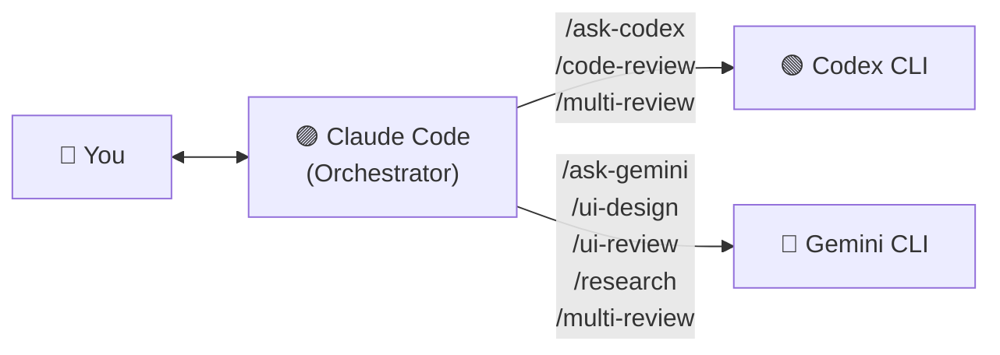

# claude-prism v0.3.0

[](https://opensource.org/licenses/MIT)
[](https://www.gnu.org/software/bash/)
[](https://claude.com/claude-code)

[繁體中文](README.zh-TW.md)

Cross-provider AI orchestration for Claude Code — eliminate same-source blind spots.

---

## Core Concept

### The Problem

When Claude Code writes your code **and** reviews it, you get same-source blind spots. It's like grading your own exam — certain classes of bugs, design flaws, and security issues consistently slip through because the same model has the same knowledge gaps.

### The Solution

Use Claude Code as the **orchestrator**, but dispatch review and research tasks to **Gemini** and **Codex** via their CLIs. Three different AI providers, three different training datasets, three different perspectives.

---

## Commands

| Command | Provider | Description |
|---------|----------|-------------|
| `/ask-codex` | Codex | Direct Q&A — get OpenAI's perspective |
| `/ask-gemini` | Gemini | Direct Q&A — get Google's perspective |
| `/code-review` | Codex | Cross-provider code review |
| `/ui-design` | Gemini | UI/UX design spec generation from requirements |
| `/ui-review` | Gemini | UI/UX accessibility & design audit |
| `/research` | Gemini | Structured technical research |
| `/multi-review` | Codex + Gemini + Claude | Triple-provider adversarial review |

### `/ask-codex` — Ask OpenAI

Direct Q&A with Codex. Good for getting a second opinion on any technical question.

```
/ask-codex What's the best way to handle optimistic updates in React Query v5?
```

### `/ask-gemini` — Ask Google

Direct Q&A with Gemini. Leverages Google's broad ecosystem knowledge.

```
/ask-gemini Compare Bun vs Deno vs Node.js for a new backend project in 2026
```

### `/code-review` — Cross-Provider Code Review

Codex reviews code that Claude wrote. The core use case — **different AI, different blind spots**.

```
/code-review                    # review staged changes
/code-review src/auth.ts        # review specific file
/code-review --diff             # review unstaged changes
/code-review --pr               # review entire PR
```

### `/ui-design` — UI/UX Design Spec Generation

Gemini generates a structured, implementable UI/UX design specification from your requirements. Outputs information architecture, ASCII wireframes, component breakdowns, interaction design, visual direction, and implementation hints. Optionally generates an HTML prototype with `--html`.

```
/ui-design a SaaS dashboard with analytics and user management
/ui-design docs/requirements.md
/ui-design --html landing page for a developer tool
```

### `/ui-review` — UI/UX Audit

Gemini reviews frontend code for accessibility, responsive design, component structure, and UX patterns.

```
/ui-review src/components/Header.tsx
/ui-review src/app/(public)/
/ui-review --screenshot ./screenshot.png   # uses Claude's vision instead
```

### `/research` — Technical Research

Gemini conducts structured technical research with comparison tables, recommendations, and resource links.

```
/research Best authentication libraries for Next.js App Router
/research Monorepo tooling: Turborepo vs Nx vs Moon
```

### `/multi-review` — Triple-Provider Adversarial Review

The flagship command. Sends the same code to **both** Codex and Gemini in parallel, then Claude synthesizes:

1. **Consensus** — issues both providers flagged (high confidence, fix first)
2. **Divergence** — issues only one found (Claude judges validity)
3. **Claude supplement** — issues neither caught

```
/multi-review                   # review staged changes
/multi-review --pr              # review entire PR
```

---

## Architecture



### How It Works

1. User types a slash command in Claude Code (e.g., `/code-review src/auth.ts`)
2. Claude Code reads the command definition (Markdown with instructions)
3. Claude reads the relevant code, builds a prompt
4. Claude calls the shell script via Bash tool → script invokes the external CLI
5. External AI processes the request and returns results
6. Claude presents the results, adding its own perspective where relevant

---

## Tech Stack

| Technology | Purpose | Notes |
|------------|---------|-------|
| Bash | CLI wrapper scripts | Handles binary detection, logging, stdin piping |
| Markdown | Slash command definitions | Claude Code reads these as instructions |
| Claude Code | Orchestrator | Reads commands, dispatches to external CLIs |
| Codex CLI | OpenAI access | Code review and Q&A (model configurable) |
| Gemini CLI | Google access | Research, UI review, Q&A (model configurable) |

---

## Quick Start

### Prerequisites

| Tool | Required | Install |
|------|----------|---------|
| [Claude Code](https://claude.com/claude-code) | Yes | `npm install -g @anthropic-ai/claude-code` |
| [Gemini CLI](https://github.com/google-gemini/gemini-cli) | For Gemini commands | `npm install -g @google/gemini-cli` |
| [Codex CLI](https://github.com/openai/codex) | For Codex commands | `npm install -g @openai/codex` |

### Install

```bash
git clone https://github.com/tznthou/claude-prism.git
cd claude-prism
./install.sh
```

The installer:
- Checks for prerequisites and reports what's available
- Backs up any existing files before overwriting
- Copies commands to `~/.claude/commands/` and scripts to `~/.claude/scripts/`

### Verify

```bash
./tests/smoke-test.sh
```

### Uninstall

```bash
./uninstall.sh
```

---

## Project Structure

```
claude-prism/
├── commands/                   # Slash command definitions (Markdown)
│   ├── ask-codex.md
│   ├── ask-gemini.md
│   ├── code-review.md
│   ├── multi-review.md
│   ├── research.md
│   ├── ui-design.md
│   └── ui-review.md
├── scripts/                    # CLI wrappers (Bash)
│   ├── call-codex.sh
│   └── call-gemini.sh
├── tests/
│   └── smoke-test.sh
├── install.sh
├── uninstall.sh
├── README.md
└── README.zh-TW.md
```

Installed to:

```
~/.claude/
├── commands/                   # ← command definitions copied here
├── scripts/                    # ← wrapper scripts copied here
└── logs/
    └── multi-ai.log            # Call logs for auditing
```

---

## Configuration

### Environment Variables

| Variable | Default | Description |
|----------|---------|-------------|
| `GEMINI_MODEL` | (CLI default) | Override Gemini model (e.g. `gemini-3-pro-preview`) |
| `CODEX_MODEL` | (CLI default) | Override Codex model (e.g. `gpt-5.3-codex`) |
| `GEMINI_BIN` | (auto-detect) | Path to gemini binary |
| `CODEX_BIN` | (auto-detect) | Path to codex binary |
| `MULTI_AI_LOG_DIR` | `~/.claude/logs` | Log directory |

By default, scripts defer to each CLI's built-in default model — no configuration needed. As CLIs update, you automatically get the latest model. To pin a specific model:

```bash
# Shell profile (~/.zshrc or ~/.bashrc)
export GEMINI_MODEL="gemini-3-pro-preview"
export CODEX_MODEL="gpt-5.3-codex"

# Or per-invocation via the -m flag
~/.claude/scripts/call-gemini.sh -m gemini-3-flash-preview "your prompt"
```

### Script Features

Both wrapper scripts support:

| Feature | Description |
|---------|-------------|
| **Binary detection** | Searches multiple paths for the CLI binary |
| **Logging** | Every call logged to `~/.claude/logs/multi-ai.log` with timestamps |
| **`--dry-run`** | Test without calling the API (no tokens consumed) |
| **Stdin piping** | `echo "code" \| call-gemini.sh "review"` for long inputs |
| **Model override** | `-m model-name` to use a different model |

### Customization

**Adding a new provider:**

1. Create `scripts/call-newprovider.sh` following the pattern of existing scripts
2. Create `commands/ask-newprovider.md` with the command definition
3. Run `./install.sh` to deploy

**Changing the review prompt:**

Edit the command `.md` files in `commands/`. The prompt templates are inline and easy to modify.

**Changing the output language:**

The command prompts default to English. To get responses in Traditional Chinese:

```diff
- "You are a Senior Code Reviewer. Review the following code."
+ "You are a Senior Code Reviewer. Review the following code. Respond in Traditional Chinese (繁體中文)."
```

---

## FAQ

**Q: Does Claude actually call the external CLIs, or does it fake the results?**

With logging enabled (default), check `~/.claude/logs/multi-ai.log` to verify. Each call is timestamped with model name and prompt/response length.

**Q: What if I only have Gemini CLI installed?**

That's fine. Commands that use Codex (`/ask-codex`, `/code-review`) will fail gracefully with an error message. Gemini-based commands (`/ask-gemini`, `/ui-design`, `/ui-review`, `/research`) will work. `/multi-review` will only get one perspective.

**Q: How much does this cost?**

Each command makes one API call to the external provider. Costs depend on your Gemini/OpenAI pricing tier. Use `--dry-run` on the scripts to test without consuming tokens.

**Q: Can I use this with other Claude Code setups?**

Yes. The commands and scripts are standalone — they only depend on `~/.claude/` directory conventions that Claude Code uses.

---

## Changelog

### v0.3.0 (2026-02-24)

- New command: `/ui-design` — UI/UX design spec generation via Gemini (information architecture, wireframes, component breakdown, visual direction)
- Optional `--html` flag generates a self-contained HTML prototype with Tailwind CDN
- Auto-detects project tech stack to inform design suggestions

### v0.2.1 (2026-02-24)

**Script hardening** — fixes identified via `/multi-review` (Codex + Gemini + Claude triple-provider review):

- **`-m` flag guard**: `-m` without a value now shows a clear error instead of crashing with "unbound variable" (`set -u`)
- **Deduplicate execution logic**: merged identical error handling from the if/else branches into a single `|| { ... }` block
- **Sanitize error logs**: error log entries no longer include response content (which could contain source code or tokens); only exit code is logged

### v0.2.0 (2026-02-24)

- Initial public release
- 6 slash commands: `/ask-codex`, `/ask-gemini`, `/code-review`, `/ui-review`, `/research`, `/multi-review`
- Model defaults deferred to CLI built-in (no hardcoded versions)
- Dry-run exits before binary check (works without CLI installed)

---

## License

This project is licensed under [MIT](LICENSE).

---

## Author

**tznthou** — [service@tznthou.com](mailto:service@tznthou.com)
