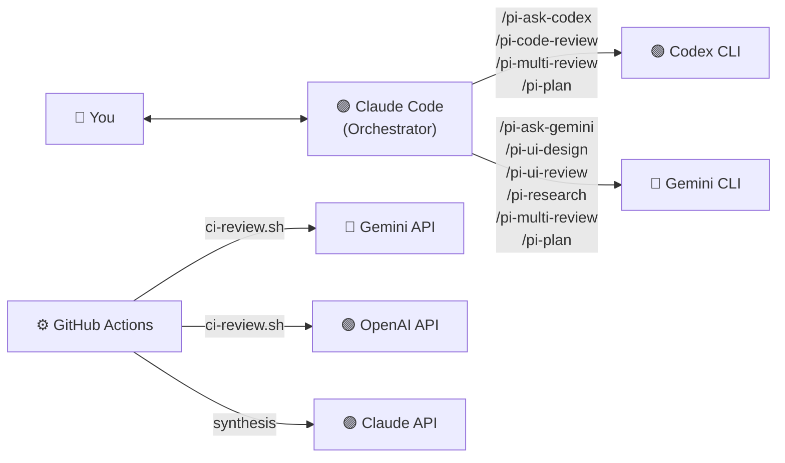

# claude-prism

<p align="center">
  
</p>

[](https://www.npmjs.com/package/claud-prism-aireview)
[](https://github.com/tznthou/homebrew-claude-prism)
[](https://opensource.org/licenses/MIT)
[](https://www.gnu.org/software/bash/)
[](https://claude.com/claude-code)
[](https://www.shellcheck.net/)

[繁體中文](README.zh-TW.md)

Cross-provider AI orchestration for Claude Code — eliminate same-source blind spots.

---

## Core Concept

### The Problem

When Claude Code writes your code **and** reviews it, you get same-source blind spots. It's like grading your own exam — certain classes of bugs, design flaws, and security issues consistently slip through because the same model has the same knowledge gaps.

### The Solution

Use Claude Code as the **orchestrator**, but dispatch review and research tasks to **Gemini** and **Codex** via their CLIs. Three different AI providers, three different training datasets, three different perspectives.

---

## Commands

| Command | Provider | Description |
|---------|----------|-------------|
| `/pi-ask-codex` | Codex | Direct Q&A — get OpenAI's perspective |
| `/pi-ask-gemini` | Gemini | Direct Q&A — get Google's perspective |
| `/pi-code-review` | Codex | Cross-provider code review (with confidence scoring) |
| `/pi-ui-design` | Gemini | HTML mockup from design spec |
| `/pi-ui-review` | Gemini | UI/UX accessibility & design audit (with confidence scoring) |
| `/pi-research` | Gemini | Structured technical research |
| `/pi-multi-review` | Codex + Gemini + Claude | Triple-provider adversarial review (smart routing + confidence scoring) |
| `/pi-plan` | Codex + Gemini + Claude | Generate structured implementation plan |
| `/pi-exec` | Claude | Execute a plan file step by step |

All commands include **graceful degradation** — if a provider is unavailable, Claude continues with the remaining providers instead of failing.

### `/pi-ask-codex` — Ask OpenAI

Direct Q&A with Codex. Good for getting a second opinion on any technical question.

```
/pi-ask-codex What's the best way to handle optimistic updates in React Query v5?
```

### `/pi-ask-gemini` — Ask Google

Direct Q&A with Gemini. Leverages Google's broad ecosystem knowledge.

```
/pi-ask-gemini Compare Bun vs Deno vs Node.js for a new backend project in 2026
```

### `/pi-code-review` — Cross-Provider Code Review

Codex reviews code that Claude wrote. The core use case — **different AI, different blind spots**.

Each issue is scored 0–100 on evidence quality (line numbers, cited rules, reproducibility). Only issues scoring ≥ 80 are shown — noise filtered, signal preserved. If your project has `CLAUDE.md` or `Agents.md`, guideline compliance is checked automatically.

```
/pi-code-review                    # review staged changes
/pi-code-review src/auth.ts        # review specific file
/pi-code-review --diff             # review unstaged changes
/pi-code-review --pr               # review entire PR
```

### `/pi-ui-design` — HTML Mockup from Design Spec

Gemini reads a design specification and generates a self-contained HTML mockup (Tailwind CDN) you can preview in a browser. Confirm the design visually, then let Claude Code implement it into your project.

```
/pi-ui-design design-spec.md              # generate HTML mockup from design spec
/pi-ui-design "a SaaS dashboard"          # no spec → Gemini drafts spec first, then mockup
```

### `/pi-ui-review` — UI/UX Audit

Gemini reviews frontend code for accessibility, responsive design, component structure, and UX patterns. Issues are confidence-scored with UI-specific factors (WCAG citations, user impact descriptions). Guideline compliance is checked if `CLAUDE.md` or `Agents.md` exists.

```
/pi-ui-review src/components/Header.tsx
/pi-ui-review src/app/(public)/
/pi-ui-review --screenshot ./screenshot.png   # uses Claude's vision instead
```

### `/pi-research` — Technical Research

Gemini conducts structured technical research with comparison tables, recommendations, and resource links.

```
/pi-research Best authentication libraries for Next.js App Router
/pi-research Monorepo tooling: Turborepo vs Nx vs Moon
```

### `/pi-multi-review` — Triple-Provider Adversarial Review

The flagship command. Sends the same code to **both** Codex and Gemini in parallel, then Claude synthesizes:

1. **Consensus** — issues both providers flagged (high confidence, fix first)
2. **Divergence** — issues only one found (Claude judges validity)
3. **Guideline compliance** — violations of `CLAUDE.md` / `Agents.md` project rules
4. **Claude supplement** — issues neither caught

**Confidence Scoring** (v0.9.0): Every issue from all providers is scored 0–100 based on evidence quality — not Claude's opinion. Only issues ≥ 80 make it to the output. Scoring is evidence-based: specific line numbers (+25), code introduced in this diff (+25), cited rules (+20), reproducible scenario (+15), multi-provider consensus (+20). This filters noise while preserving cross-provider blind spot elimination.

**Smart Routing** (v0.7.0): Automatically detects the domain of changes (frontend/backend/fullstack) from file extensions and paths. During synthesis, the domain-authoritative provider gets higher weight — Gemini for frontend (UI/UX expertise), Codex for backend (security/algorithm expertise). Both providers are always called; weighting only affects how Claude resolves disagreements.

```
/pi-multi-review                   # review staged changes
/pi-multi-review --pr              # review entire PR
```

### `/pi-plan` — Structured Implementation Planning

Analyze the codebase and generate a structured plan file with multi-provider perspectives. Optionally consults Codex and Gemini for independent technical analysis.

Plans are saved to `.claude/pi-plans/` and include: context, multi-provider analysis, step-by-step implementation, key files, risks, and verification criteria. Plans persist across sessions.

```
/pi-plan Add JWT authentication to the API
/pi-plan Refactor the payment module to support Stripe
```

### `/pi-exec` — Plan Execution with Resume

Execute a plan file step by step, updating progress checkboxes as you go. If a session ends mid-execution, running `/pi-exec` again resumes from the last unchecked step.

```
/pi-exec .claude/pi-plans/add-jwt-authentication.md
```

---

## Architecture



### How It Works

1. User types a slash command in Claude Code (e.g., `/pi-code-review src/auth.ts`)
2. Claude Code reads the command definition (Markdown with instructions)
3. Claude reads the relevant code, builds a prompt
4. Claude calls the shell script via Bash tool → script invokes the external CLI
5. External AI processes the request and returns results
6. Claude presents the results, adding its own perspective where relevant
7. For review commands, structured insights are logged to `review-insights.jsonl` for trend analysis

---

## Tech Stack

| Technology | Purpose | Notes |
|------------|---------|-------|
| Bash | CLI wrapper scripts | Handles binary detection, logging, stdin piping |
| Markdown | Slash command definitions | Claude Code reads these as instructions |
| Claude Code | Orchestrator | Reads commands, dispatches to external CLIs |
| Codex CLI | OpenAI access | Code review and Q&A (model configurable) |
| Gemini CLI | Google access | Research, UI review, Q&A (model configurable) |
| GitHub Actions | CI/CD integration | Automated PR review via REST APIs |

---

## Quick Start

### Prerequisites

| Tool | Required | Install |
|------|----------|---------|
| [Claude Code](https://claude.com/claude-code) | Yes | `npm install -g @anthropic-ai/claude-code` |
| [Gemini CLI](https://github.com/google-gemini/gemini-cli) | For Gemini commands | `npm install -g @google/gemini-cli` |
| [Codex CLI](https://github.com/openai/codex) | For Codex commands | `npm install -g @openai/codex` |

### Install

**Quick install (recommended)**

```bash
npx claud-prism-aireview
```

**Homebrew (macOS)**

```bash
brew tap tznthou/claude-prism
brew install claud-prism-aireview
```

**Manual**

```bash
git clone https://github.com/tznthou/claude-prism.git
cd claude-prism
./install.sh
```

The installer:
- Checks for prerequisites and reports what's available
- Verifies file integrity via SHA256 checksums (if `checksums.sha256` is present)
- Backs up any existing files before overwriting
- Copies commands to `~/.claude/commands/` and scripts to `~/.claude/scripts/`

### Verify

```bash
./tests/smoke-test.sh
```

### Uninstall

```bash
npx claud-prism-aireview --uninstall
# or manually:
./uninstall.sh
```

---

## Project Structure

```
claude-prism/
├── .github/workflows/
│   ├── ai-review.yml           # GitHub Actions workflow for CI review
│   └── shellcheck.yml          # ShellCheck static analysis for shell scripts
├── commands/                   # Slash command definitions (Markdown)
│   ├── pi-ask-codex.md
│   ├── pi-ask-gemini.md
│   ├── pi-code-review.md
│   ├── pi-exec.md
│   ├── pi-multi-review.md
│   ├── pi-plan.md
│   ├── pi-research.md
│   ├── pi-ui-design.md
│   └── pi-ui-review.md
├── scripts/                    # CLI wrappers & utilities (Bash)
│   ├── call-codex.sh           # Codex CLI wrapper
│   ├── call-gemini.sh          # Gemini CLI wrapper
│   ├── detect-domain.sh        # Domain detection for smart routing
│   ├── ci-review.sh            # CI/CD review orchestrator (curl APIs)
│   ├── usage-summary.sh        # API usage statistics
│   └── review-insights.sh      # Review pattern analysis
├── tests/
│   └── smoke-test.sh
├── checksums.sha256            # SHA256 checksums for integrity verification
├── install.sh
├── uninstall.sh
├── README.md
└── README.zh-TW.md
```

Installed to:

```
~/.claude/
├── commands/                   # ← command definitions copied here
├── scripts/                    # ← wrapper scripts copied here
└── logs/
    ├── multi-ai.log            # Call logs (timestamps, prompt/response lengths)
    └── review-insights.jsonl   # Structured review history (auto-recorded)

# Created at runtime by /pi-plan:
.claude/pi-plans/               # ← plan files (project-local, cross-session)
```

---

## Configuration

### Environment Variables

| Variable | Default | Description |
|----------|---------|-------------|
| `GEMINI_MODEL` | (CLI default) | Override Gemini model (e.g. `gemini-3-pro-preview`) |
| `CODEX_MODEL` | (CLI default) | Override Codex model (e.g. `gpt-5.3-codex`) |
| `GEMINI_BIN` | (auto-detect) | Path to gemini binary |
| `CODEX_BIN` | (auto-detect) | Path to codex binary |
| `MULTI_AI_LOG_DIR` | `~/.claude/logs` | Log directory |

By default, scripts defer to each CLI's built-in default model — no configuration needed. As CLIs update, you automatically get the latest model. To pin a specific model:

```bash
# Shell profile (~/.zshrc or ~/.bashrc)
export GEMINI_MODEL="gemini-3-pro-preview"
export CODEX_MODEL="gpt-5.3-codex"

# Or per-invocation via the -m flag
~/.claude/scripts/call-gemini.sh -m gemini-3-flash-preview "your prompt"
```

### Script Features

Both wrapper scripts support:

| Feature | Description |
|---------|-------------|
| **Binary detection** | Searches multiple paths for the CLI binary |
| **Logging** | Every call logged to `~/.claude/logs/multi-ai.log` with timestamps |
| **`--dry-run`** | Test without calling the API (no tokens consumed) |
| **Stdin piping** | `echo "code" \| call-gemini.sh "review"` for long inputs |
| **Model override** | `-m model-name` to use a different model |

### Customization

**Adding a new provider:**

1. Create `scripts/call-newprovider.sh` following the pattern of existing scripts
2. Create `commands/ask-newprovider.md` with the command definition
3. Run `./install.sh` to deploy

**Changing the review prompt:**

Edit the command `.md` files in `commands/`. The prompt templates are inline and easy to modify.

**Changing the output language:**

The command prompts default to English. To get responses in Traditional Chinese:

```diff
- "You are a Senior Code Reviewer. Review the following code."
+ "You are a Senior Code Reviewer. Review the following code. Respond in Traditional Chinese (繁體中文)."
```

---

## Observability

### Usage Summary

Track API call volume and estimated token consumption:

```bash
~/.claude/scripts/usage-summary.sh            # today
~/.claude/scripts/usage-summary.sh --week      # last 7 days
~/.claude/scripts/usage-summary.sh --all       # all time
~/.claude/scripts/usage-summary.sh --date 2026-02-24  # specific date
```

Output includes per-provider call counts, success/error/dry-run breakdown, and a rough token estimate (~4 chars/token).

### Review Insights

After each `/pi-code-review` or `/pi-multi-review`, Claude automatically records structured issue data to `~/.claude/logs/review-insights.jsonl`. Analyze patterns over time:

```bash
~/.claude/scripts/review-insights.sh              # full analysis
~/.claude/scripts/review-insights.sh --recent 10  # last 10 reviews
~/.claude/scripts/review-insights.sh --project my-app  # filter by project
```

Output includes:
- **Category distribution** — security, performance, design, logic, etc. (with bar chart)
- **Severity breakdown** — critical / medium / suggestion
- **Discovery source** — consensus vs. single-provider findings
- **Most frequent issues** — recurring patterns highlighted
- **Recent review timeline** — last 5 reviews with issue counts

Each review record follows this schema:

```json
{
  "date": "2026-02-24T10:30:00Z",
  "project": "my-app",
  "scope": "pr",
  "domain": "backend",
  "providers": ["codex", "gemini", "claude"],
  "issues": [
    {
      "category": "security",
      "severity": "critical",
      "confidence": 95,
      "title": "SQL injection in user input handler",
      "source": "consensus"
    }
  ]
}
```

Categories: `security`, `performance`, `design`, `logic`, `maintainability`, `guideline`, `accessibility`, `other`. The `guideline` category tracks violations of project-specific rules (`CLAUDE.md` / `Agents.md`).

---

## CI/CD Integration

Automate multi-provider reviews on every PR via GitHub Actions. The CI path uses REST APIs directly (no CLI installation needed on runners).

### Quick Setup

1. Copy the workflow file to your project:

```bash
mkdir -p .github/workflows
cp path/to/claude-prism/.github/workflows/ai-review.yml .github/workflows/
cp path/to/claude-prism/scripts/ci-review.sh scripts/
```

2. Add API keys as GitHub Secrets (at least one required):

| Secret | Provider | Required? |
|--------|----------|-----------|
| `GEMINI_API_KEY` | Gemini review | Optional |
| `OPENAI_API_KEY` | OpenAI review | Optional |
| `ANTHROPIC_API_KEY` | Claude synthesis | Optional |

3. Add the `ai-review` label to a PR to trigger the review.

### Trigger Modes

**Label trigger (default):** Add `ai-review` label to a PR → workflow runs. Best for cost control.

**Auto trigger:** Uncomment the `pull_request: [opened, synchronize]` block in the workflow file → runs on every PR update.

### How It Works (CI)

1. GitHub Actions checks out the PR and fetches the diff
2. `ci-review.sh` auto-discovers `CLAUDE.md` / `Agents.md` for guideline context
3. Diff is sent to available providers (Gemini API, OpenAI API) in parallel, with false-positive exclusion rules
4. If `ANTHROPIC_API_KEY` is set, Claude synthesizes with confidence scoring (only issues ≥ 80 posted)
5. If not, results are concatenated directly
6. Output is posted as a PR comment

### CI Environment Variables

| Variable | Default | Description |
|----------|---------|-------------|
| `GEMINI_MODEL` | `gemini-2.0-flash` | Gemini model for CI review |
| `OPENAI_MODEL` | `gpt-4o` | OpenAI model for CI review |
| `ANTHROPIC_MODEL` | `claude-sonnet-4-20250514` | Claude model for synthesis |
| `MAX_DIFF_CHARS` | `32000` | Diff truncation limit |

### Security Notes

- **Fork PRs**: The workflow uses `pull_request` (not `pull_request_target`), so fork PRs cannot access your secrets. This is intentional — fork PRs are skipped.
- **API keys**: Use GitHub repository secrets. Never commit API keys to the repo.
- **Concurrency**: Only one review runs per PR at a time; new pushes cancel in-progress reviews.

---

## FAQ

**Q: Does Claude actually call the external CLIs, or does it fake the results?**

With logging enabled (default), check `~/.claude/logs/multi-ai.log` to verify. Each call is timestamped with model name and prompt/response length.

**Q: What if I only have Gemini CLI installed?**

That's fine. All commands include graceful degradation — if a provider is unavailable, Claude continues with the remaining providers. `/pi-multi-review` will use Claude + Gemini (two perspectives instead of three). `/pi-code-review` will fall back to a Claude-only review with a caveat note.

**Q: What if a provider returns an unexpected format?**

Claude handles it. If Codex or Gemini doesn't follow the requested emoji/score format, Claude extracts actionable insights from the raw text using semantic matching rather than format parsing. Scores show "—" in the comparison table when not provided.

**Q: How much does this cost?**

Each command makes one API call to the external provider. Costs depend on your Gemini/OpenAI pricing tier. Use `--dry-run` on the scripts to test without consuming tokens. Run `~/.claude/scripts/usage-summary.sh` to see call counts and estimated token consumption over time.

**Q: Can I use this with other Claude Code setups?**

Yes. The commands and scripts are standalone — they only depend on `~/.claude/` directory conventions that Claude Code uses.

---

## Reflections

In the age of AI-assisted coding, most developers have access to the "big three" CLIs: Claude, Codex, and Gemini. After subscribing to Claude Code, I kept thinking: since I already have a powerful orchestrator at hand, why not leverage other providers' CLIs at the same time? Whether it's code review, technical research, or UI/UX design, having different AIs approach the same problem from different angles yields more comprehensive results than any single source.

I looked around, but the existing tools I found were either too heavy or didn't integrate well with Claude Code's workflow. So I decided to build my own.

It started as a few simple wrapper scripts to handle everyday review tasks. But as I kept building, more possibilities emerged: triple-provider adversarial review, review trend analysis, CI/CD automation... None of these were in the original plan, yet each one felt genuinely useful.

So here we are. I hope this tool helps you too.

---

## Changelog

### v0.9.0 (2026-03-05)

**Confidence Scoring & Guideline Compliance** — evidence-based noise filtering and project rule enforcement across all review commands.

- **Confidence scoring** — every review issue scored 0–100 on evidence quality (line numbers, cited rules, reproducibility, consensus). Only issues ≥ 80 shown. Scoring is evidence-based, not opinion-based — Claude cannot veto cross-provider findings with strong evidence
- **Guideline compliance** — auto-discovers `CLAUDE.md` and `Agents.md` in the project, checks code against project-specific rules. Ready for the emerging `Agents.md` standard
- **False positive filtering** — explicit exclusion rules in all review prompts: no pre-existing issues, no linter-detectable problems, no pedantic nitpicks, no lint-ignore lines
- **Applied to**: `/pi-code-review`, `/pi-multi-review`, `/pi-ui-review`, `ci-review.sh`
- **Review insights enhanced** — JSON schema adds `confidence` score and `guideline` category

### v0.8.0 (2026-03-04)

**Distribution** — added `npx` and Homebrew install support.

- `npx claud-prism-aireview` for one-command install
- `brew tap tznthou/claude-prism && brew install claud-prism-aireview` for macOS
- Added GitHub Release workflow for automated npm publishing
- Legacy command cleanup in install/uninstall scripts

### v0.7.0 (2026-03-04)

**Smart Routing, Plan/Execute & Command Namespace** — domain-aware review weighting, persistent planning, and `pi-` prefix for all commands.

#### Breaking: `pi-` command prefix

All 9 commands are now prefixed with `pi-` (e.g., `/code-review` → `/pi-code-review`, `/research` → `/pi-research`).

**Why?** Claude Code has a built-in `/plan` command (enters plan mode). Our new `/plan` command for persistent planning would collide with it. Rather than only prefixing the conflicting commands, we chose to prefix **all** commands uniformly for namespace safety and brand identity. The `pi-` prefix (from **P**rism **I**nitial) is short enough to type quickly while making it clear which commands belong to claude-prism.

**Migration:** After updating, re-run `./install.sh`. The installer will overwrite the old command files. To clean up old (unprefixed) commands manually:

```bash
cd ~/.claude/commands
rm -f ask-codex.md ask-gemini.md code-review.md multi-review.md \
     research.md ui-design.md ui-review.md plan.md execute.md
```

#### Smart routing

`/pi-multi-review` now auto-detects the **domain** of the code changes (frontend / backend / fullstack) and adjusts provider weight during synthesis.

**How it works:**

1. File paths from the review scope are piped to `detect-domain.sh`
2. The script classifies each file by extension and path:
   - Frontend signals: `.css`, `.tsx`, `.jsx`, `.vue`, `.svelte`, `.html`, `.svg` / `components/`, `pages/`, `styles/`, `ui/`
   - Backend signals: `.go`, `.py`, `.rs`, `.java`, `.sql`, `.proto` / `api/`, `controllers/`, `models/`, `middleware/`, `migrations/`
   - Neutral (not counted): `.ts`, `.js`, `.json`, `.yaml`, `.md`, `.sh`
3. If ≥ 70% of classifiable files lean one way → that domain; otherwise → `fullstack`

**During synthesis:**

| Domain | Gemini weight | Codex weight | Rationale |
|--------|-------------|------------|-----------|
| frontend | Higher | Standard | Gemini excels at UI/UX, accessibility, design patterns |
| backend | Standard | Higher | Codex excels at algorithms, security, API design |
| fullstack | Equal | Equal | No domain advantage |

**Design philosophy: "weight, don't route."** Both providers are **always** called. The domain only affects how Claude resolves disagreements — if both providers agree on an issue, it's reported regardless of weighting. This preserves graceful degradation: if one provider is down, the other still covers the full review.

#### Plan/Execute

Two new commands for persistent, cross-session task planning:

**`/pi-plan <task description>`** — Analyze the codebase and generate a structured plan file:

- Optionally consults Codex and Gemini in parallel for independent technical analysis
- Detects domain via `detect-domain.sh` to contextualize recommendations
- Outputs a markdown plan to `.claude/pi-plans/<slug>.md` with: context, multi-provider analysis, step-by-step implementation (with checkboxes), key files, risks, and verification criteria
- **Does not auto-execute** — the plan is a proposal for the user to review

**`/pi-exec <plan-file>`** — Execute a plan step by step:

- Reads the plan, validates status (draft / approved / in-progress / completed)
- Executes each step sequentially, updating `- [ ]` → `- [x]` as it goes
- If a step fails, stops and asks the user how to proceed
- **Resume support:** If a session ends mid-execution, running `/pi-exec` on the same file resumes from the first unchecked step — no progress is lost

**Why not SESSION_ID?** Some planning tools use session IDs and a separate binary to track state. We use markdown checkboxes instead — the plan file itself **is** the state. This keeps the mechanism simple (no external dependencies), human-readable (you can edit the plan in any editor), and consistent with our zero-compile-dependency principle.

#### Other changes

- **Review insights enhanced** — `review-insights.jsonl` now includes a `domain` field for domain-aware trend analysis
- **`detect-domain.sh`** — new standalone utility script (can be used outside of multi-review; reads file paths from stdin)

### v0.6.0 (2026-03-03)

**Security Hardening** — security audit and fixes across all shell scripts:

- **Temp file safety** — `review-insights.sh` now uses `mktemp` instead of a predictable `/tmp` path (symlink attack prevention)
- **Input validation** — `ci-review.sh` validates `--pr` argument as a positive integer
- **Process visibility** — `call-codex.sh` and `call-gemini.sh` now always pipe prompts via stdin (prevents exposure in `ps` output)
- **Install integrity** — `install.sh` verifies SHA256 checksums before installing (new `checksums.sha256` file)
- **ShellCheck CI** — new GitHub Actions workflow for static analysis on all shell scripts
- **ShellCheck fixes** — removed unused variables, fixed invalid `>=` operator, quoted command substitutions

### v0.5.0 (2026-02-24)

**CI/CD Integration** — automated multi-provider PR review via GitHub Actions:

- **`ci-review.sh`** — CI/CD review orchestrator that calls Gemini API + OpenAI API in parallel, with optional Claude synthesis. Uses REST APIs directly (no CLI installation needed)
- **GitHub Actions workflow** (`ai-review.yml`) — label-triggered or auto-triggered PR review with concurrency control
- **Graceful degradation in CI** — works with any combination of API keys (1-3 providers)
- **Large diff handling** — auto-truncation at 32K chars (configurable via `MAX_DIFF_CHARS`)
- Smoke test expanded to 24 tests (from 20)

<details>
<summary>Earlier versions</summary>

### v0.4.0 (2026-02-24)

**Reliability & Observability** — graceful degradation, usage tracking, and review insights:

- **Graceful degradation** across all 7 commands — if a provider fails, Claude continues with remaining providers instead of aborting. Non-conforming output (no emoji, no score) is handled via semantic extraction
- **`usage-summary.sh`** — per-provider call stats, success/error breakdown, estimated token consumption (`--week`, `--all`, `--date`)
- **`review-insights.sh`** — analyze recurring patterns from review history (category/severity distribution, consensus vs. single-provider findings, most frequent issues)
- **Review insights auto-recording** — `/code-review` and `/multi-review` append structured JSONL after each review for trend analysis
- Smoke test expanded to 20 tests (from 14)

### v0.3.1 (2026-02-24)

- **`/ui-design` redesigned** — now generates a previewable HTML mockup (Tailwind CDN) from design spec files
- Workflow: design spec → HTML mockup → browser preview → confirm → Claude Code implements
- Text input (no spec file) triggers a two-step flow: generate spec → generate mockup
- Next steps presented as choices (adjust, implement, or `/ui-review`)

### v0.3.0 (2026-02-24)

- New command: `/ui-design` — UI/UX design spec generation via Gemini (information architecture, wireframes, component breakdown, visual direction)
- Optional `--html` flag generates a self-contained HTML prototype with Tailwind CDN
- Auto-detects project tech stack to inform design suggestions

### v0.2.1 (2026-02-24)

**Script hardening** — fixes identified via `/multi-review` (Codex + Gemini + Claude triple-provider review):

- **`-m` flag guard**: `-m` without a value now shows a clear error instead of crashing with "unbound variable" (`set -u`)
- **Deduplicate execution logic**: merged identical error handling from the if/else branches into a single `|| { ... }` block
- **Sanitize error logs**: error log entries no longer include response content (which could contain source code or tokens); only exit code is logged

### v0.2.0 (2026-02-24)

- Initial public release
- 6 slash commands: `/ask-codex`, `/ask-gemini`, `/code-review`, `/ui-review`, `/research`, `/multi-review`
- Model defaults deferred to CLI built-in (no hardcoded versions)
- Dry-run exits before binary check (works without CLI installed)

</details>

---

## License

This project is licensed under [MIT](LICENSE).

---

## Author

**tznthou** — [tznthou.com](https://tznthou.com) · [service@tznthou.com](mailto:service@tznthou.com)
