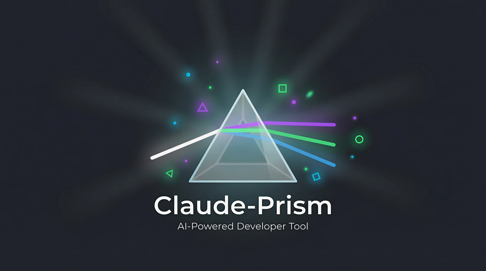
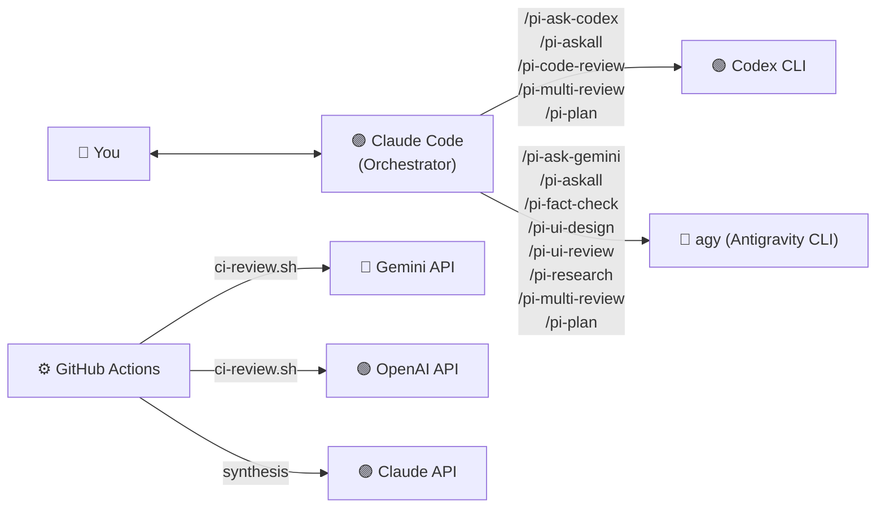
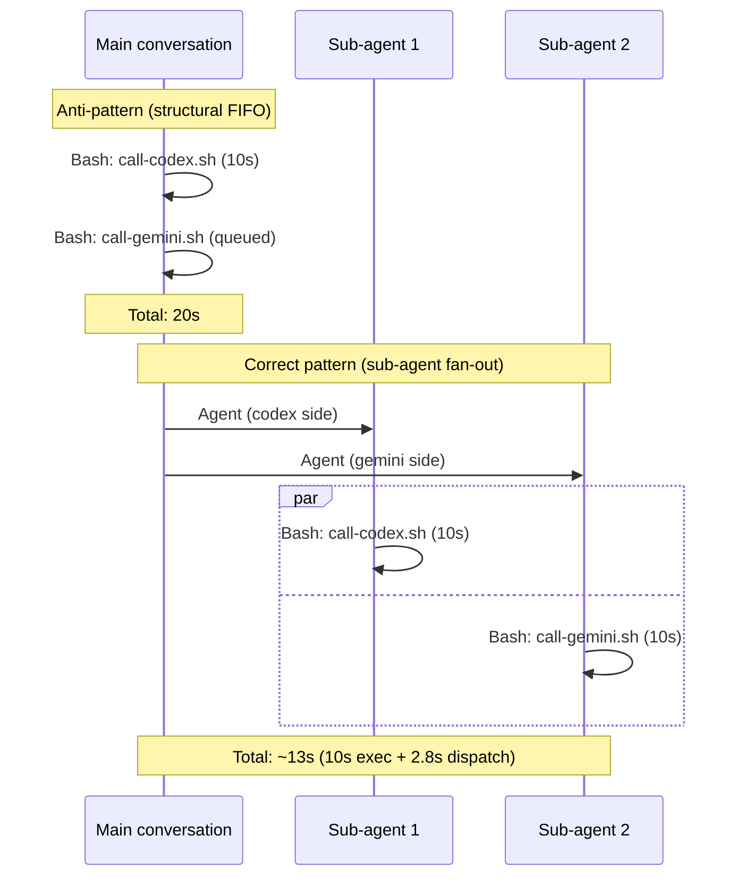

# claude-prism

<p align="center">
  
</p>

[](https://www.npmjs.com/package/claud-prism-aireview)
[](https://github.com/tznthou/homebrew-claude-prism)
[](https://opensource.org/licenses/MIT)
[](https://www.gnu.org/software/bash/)
[](https://claude.com/claude-code)
[](https://www.shellcheck.net/)
[](CODE_OF_CONDUCT.md)

[繁體中文](README.zh-TW.md)

Cross-provider AI orchestration for Claude Code — eliminate same-source blind spots.

---

## Core Concept

### The Problem

AI code review is noisy. Even the best tools on the market only hit around 64% F1 score — a significant fraction of findings are either false positives or missed issues. Most tools try to fix this by having AI self-assess its own confidence ("I'm 90% sure this is a real bug"), but that's grading your own exam.

There's a deeper structural issue: when Claude Code writes your code **and** reviews it, you get **same-source blind spots**. Certain classes of bugs, design flaws, and security issues consistently slip through because the same model has the same knowledge gaps. Even multi-agent review within a single provider doesn't help — four Claude agents still share the same training data and biases. More agents ≠ more perspectives.

### The Solution

**1. Cross-provider triangulation** — Claude orchestrates, but dispatches review tasks to **Gemini** and **Codex** via their CLIs. Three providers, three training datasets, three sets of blind spots that cancel each other out.

**2. Evidence-based confidence scoring** — Instead of asking AI "how confident are you?", each finding is scored by verifiable evidence: specific line numbers (+25), rule citations (+20), reproducible scenarios (+15), hallucinated references (-50). The core formula is deterministic — same evidence, same score. [Open spec](spec/confidence-scoring-v1.md), no black box.

**3. Local-first** — Your code goes directly to each provider's API. No intermediary server, no relay, no third party touching your code.

### Why claude-prism?

| | claude-prism | Single-provider multi-agent review |
|---|---|---|
| **Provider diversity** | Codex + Gemini + Claude (3 independent models) | Multiple agents, same underlying model |
| **Blind spot coverage** | Cross-training-data: each model catches what others miss | Same training data bias amplified across agents |
| **Cost** | Near-zero (runs on existing Codex CLI / Antigravity CLI subscriptions) | $15–25 per PR (official tools, Team/Enterprise plans) |
| **Speed** | 1–2 minutes | ~20 minutes |
| **Availability** | Anyone with CLI access | Paid team plans only |
| **Scoring method** | Evidence-based formula ([open spec](spec/confidence-scoring-v1.md)) — deterministic core, same evidence = same score | LLM self-assessment — AI grades its own confidence |
| **Data path** | Local-first: direct to provider APIs, no intermediary server | Varies by service |

### Compared to `/ultrareview` (released 2026-04-16)

Anthropic shipped [`/ultrareview`](https://code.claude.com/docs/en/ultrareview.md) alongside Claude Opus 4.7 on 2026-04-16 — a cloud-hosted review that spins up a fleet of Claude agents in a remote sandbox, with each finding independently verified. It's a genuine upgrade over single-pass `/review`, but it plays a different game than claude-prism:

| | claude-prism `/pi-multi-review` | `/ultrareview` |
|---|---|---|
| **Model diversity** | Codex + Gemini + Claude (3 independent models) | Many Claude agents, one underlying model |
| **Blind-spot strategy** | Heterogeneous training data cancels shared gaps | Homogeneous — more passes, same gaps |
| **Review stance** | Adversarial, divided attack surfaces | Verification-focused (lower false-positive rate) |
| **Free tier** | Unlimited (uses existing CLI subscriptions) | 3 runs per account, one-time — does not refresh |
| **Team / Enterprise free runs** | Unlimited | 0 |
| **After free tier** | Still unlimited | ~$5–$20 per run as extra usage |
| **API-key-only Claude Code** | Works | Blocked (Claude.ai login required) |
| **Bedrock / Vertex / Foundry** | Works (provider-agnostic) | Not supported |
| **Zero Data Retention orgs** | Works | Blocked |
| **CI/CD** | `ci-review.sh` in GitHub Actions | Interactive session only |

The two tools optimize for different scenarios. `/ultrareview` is a solid pre-merge confidence boost for Pro/Max users working inside the Claude ecosystem. `/pi-multi-review` exists for everything outside that box — CI pipelines, regulated / ZDR environments, teams without Pro/Max seats, and anyone who wants perspectives that don't share Claude's training data.

### Why Trust the Findings?

Most AI review tools use a similar approach: have the AI score its own findings on a 0–100 confidence scale, then filter below a threshold. [Anthropic's official code review plugin](https://github.com/anthropics/claude-code/blob/main/plugins/code-review/README.md), for example, uses a ≥80 threshold. The problem is that LLM-generated confidence scores are non-deterministic — run the same review twice, you may get different scores.

claude-prism's [Confidence Scoring Framework](spec/confidence-scoring-v1.md) works differently: it scores findings by **verifiable evidence**, not AI self-assessment. Does the comment cite a specific line number? +25. Does it reference an OWASP rule? +20. Does it mention a file that doesn't exist? -50. The formula is deterministic, model-agnostic, and fully auditable — you can open the spec and verify exactly how every point was calculated.

---

## Quick Start

### Prerequisites

| Tool | Required | Install |
|------|----------|---------|
| [Claude Code](https://claude.com/claude-code) | Yes | `npm install -g @anthropic-ai/claude-code` |
| [Antigravity CLI (`agy`)](https://github.com/google-antigravity/antigravity-cli) | For Gemini commands | `curl -fsSL https://antigravity.google/cli/install.sh \| bash` |
| [Codex CLI](https://github.com/openai/codex) | For Codex commands | `npm install -g @openai/codex` |

> **✅ Antigravity CLI Migration (completed June 2026)**
>
> Google [transitioned Gemini CLI to Antigravity CLI](https://developers.googleblog.com/an-important-update-transitioning-gemini-cli-to-antigravity-cli/) at I/O 2026 — `@google/gemini-cli` stopped serving Google AI Pro, Ultra, and free Code Assist users on **June 18, 2026**. claude-prism migrated ahead of the cutoff: `call-gemini.sh` now drives [`agy`](https://github.com/google-antigravity/antigravity-cli) non-interactively via Google AI Pro OAuth.
>
> **What stays the same**: the script name, the `[gemini]` log tag, and the `GEMINI_MODEL` override all keep working — existing logs and commands are unaffected.
>
> **What changed**: authentication is OAuth-only (run `agy` once to log in; `GEMINI_API_KEY` is no longer read by the wrapper), and the binary path override is now `AGY_BIN` (`GEMINI_BIN` is honored as a deprecated alias only if it points to an `agy` binary). If you still have `@google/gemini-cli` installed, it is no longer used — you can uninstall it.

### Install

**Quick install (recommended)**

```bash
npx claud-prism-aireview
```

This downloads the package and runs the installer in one step — it deploys commands to `~/.claude/commands/` and scripts to `~/.claude/scripts/`. No `postinstall` scripts are used; you explicitly run this command yourself.

**npm global install**

```bash
npm install -g claud-prism-aireview
claud-prism-aireview   # ← Required: deploys commands and scripts to ~/.claude/
```

> **Important:** `npm install -g` only places the binary in your PATH. You must run `claud-prism-aireview` once to actually deploy the commands. This is by design — we intentionally avoid `postinstall` scripts for [supply chain security](docs/supply-chain-security.md).

**Homebrew (macOS)**

```bash
brew tap tznthou/claude-prism
brew install claud-prism-aireview
```

**Manual**

```bash
git clone https://github.com/tznthou/claude-prism.git
cd claude-prism
./install.sh
```

The installer checks prerequisites, verifies file integrity via SHA256 checksums, backs up existing files, then copies commands to `~/.claude/commands/` and scripts to `~/.claude/scripts/`.

### Verify

```bash
./tests/smoke-test.sh
```

### Uninstall

```bash
npx claud-prism-aireview --uninstall
# or manually:
./uninstall.sh
```

---

## Commands

| Command | Provider | Description |
|---------|----------|-------------|
| `/pi-ask-codex` | Codex | Direct Q&A — get OpenAI's perspective |
| `/pi-ask-gemini` | Gemini | Direct Q&A — get Google's perspective |
| `/pi-askall` | Codex + Gemini + Claude | Ask all providers the same question — three perspectives with synthesis |
| `/pi-code-review` | Codex | Adversarial code review — break confidence in changes, not validate them (with confidence scoring) |
| `/pi-fact-check` | Gemini + WebSearch + Claude | Fact-check content — dual-track search (Gemini + WebSearch), Claude validates with convergence scoring |
| `/pi-ui-design` | Gemini | HTML mockup from design spec |
| `/pi-ui-review` | Gemini | UI/UX accessibility & design audit (with confidence scoring) |
| `/pi-research` | Gemini + WebSearch + Claude | Structured technical research — dual-track search (Gemini + WebSearch parallel) |
| `/pi-multi-review` | Codex + Gemini + Claude | Triple-provider adversarial review with divided attack surfaces (smart routing + confidence scoring) |
| `/pi-plan` | Codex + Gemini + Claude | Multi-provider implementation planning for architectural decisions |

All commands include **graceful degradation** — if a provider is unavailable, Claude continues with the remaining providers instead of failing. Every failure includes a **structured error diagnostic** (TIMEOUT, RATE_LIMIT, AUTH_ERROR, PERMISSION, SANDBOX, NETWORK, EMPTY_OUTPUT, CLI_ERROR, or CLI_NOT_FOUND) and suggests an alternative command.

### `/pi-ask-codex` — Ask OpenAI

Direct Q&A with Codex. Good for getting a second opinion on any technical question.

```
/pi-ask-codex What's the best way to handle optimistic updates in React Query v5?
```

### `/pi-ask-gemini` — Ask Google

Direct Q&A with Gemini. Leverages Google's broad ecosystem knowledge.

```
/pi-ask-gemini Compare Bun vs Deno vs Node.js for a new backend project in 2026
```

### `/pi-askall` — Ask All Providers

Ask Codex and Gemini the same question in parallel, then Claude synthesizes all three perspectives. Works with **any topic** — not limited to code. Each provider responds independently (no cross-contamination), then Claude compares consensus, flags divergence, and delivers an integrated take.

```
/pi-askall Should we use a monorepo or polyrepo for the new microservices?
/pi-askall What's the best approach for real-time sync in a collaborative editor?
```

### `/pi-fact-check` — Cross-Provider Fact Verification

Dual-track search: Gemini (search grounding) and WebSearch run simultaneously — no dead-wait time. Claude cross-verifies with independent judgment, validates URLs, and scores confidence using source convergence (how many independent sources agree). Includes source tier ranking (L1 official records through L6 community), editorial chain deduplication, and adversarial evidence checking.

```
/pi-fact-check article.md
/pi-fact-check https://example.com/blog-post
/pi-fact-check "Tesla delivered 1.8M vehicles in 2024 and holds over 50% market share"
```

### `/pi-code-review` — Adversarial Code Review

Codex reviews code that Claude wrote with an **adversarial stance** — the reviewer's job is to break confidence in the change, not validate it. The core use case is still **different AI, different blind spots**, but the prompt has been upgraded from a neutral "Senior Reviewer" to an adversarial role with 9 attack surface categories (auth, data loss, race conditions, rollback safety, etc.), a finding bar (every finding must answer: what can go wrong, why vulnerable, likely impact, concrete fix), and calibration rules ("prefer one strong finding over several weak ones").

Each issue is scored 0–100 using the [Confidence Scoring Framework](spec/confidence-scoring-v1.md) — evidence-based, deterministic noise filtering. Only issues scoring ≥ 80 are shown. Reviews also check inline annotation compliance (`IMPORTANT`/`WARNING`/`TODO` comments) and, in `--pr` mode, surface recurring issues from historical PR comments on the same files.

```
/pi-code-review                    # review staged changes
/pi-code-review src/auth.ts        # review specific file
/pi-code-review --diff             # review unstaged changes
/pi-code-review --pr               # review entire PR
```

### `/pi-ui-design` — HTML Mockup from Design Spec

Gemini reads a design specification and generates a self-contained HTML mockup (Tailwind v4 CDN) you can preview in a browser. Confirm the design visually, then let Claude Code implement it into your project.

```
/pi-ui-design design-spec.md              # generate HTML mockup from design spec
/pi-ui-design "a SaaS dashboard"          # no spec → Gemini drafts spec first, then mockup
```

### `/pi-ui-review` — UI/UX Audit

Gemini reviews frontend code for accessibility, responsive design, component structure, and UX patterns. Issues are confidence-scored with UI-specific factors (WCAG citations, user impact descriptions). Guideline compliance is checked if `CLAUDE.md` or `Agents.md` exists.

```
/pi-ui-review src/components/Header.tsx
/pi-ui-review src/app/(public)/
/pi-ui-review --screenshot ./screenshot.png   # uses Claude's vision instead
```

### `/pi-research` — Technical Research

Dual-track search: Gemini (search grounding) and WebSearch run in parallel for structured technical research with comparison tables, recommendations, and source URLs. If one track fails, the other covers the gap — same resilience architecture as `/pi-fact-check`. If the topic relates to the current project, relevant context (dependencies, existing patterns) is automatically included. Results can optionally be saved to `.claude/pi-research/` for future reference.

```
/pi-research Best authentication libraries for Next.js App Router
/pi-research Monorepo tooling: Turborepo vs Nx vs Moon
```

### `/pi-multi-review` — Triple-Provider Adversarial Review (Divided Attack Surfaces)

The flagship command. Sends the same code to **both** Codex and Gemini for **adversarial review with divided attack surfaces** — Codex attacks security & data integrity (auth, data loss, race conditions, schema drift, etc.), Gemini attacks design, UX & maintainability (edge-case UX, accessibility, abstraction leaks, test coverage, etc.). Claude synthesizes:

1. **Consensus** — issues both providers flagged (high confidence, fix first)
2. **Divergence** — issues only one found (Claude judges validity)
3. **Guideline compliance** — violations of `CLAUDE.md` / `Agents.md` project rules
4. **Claude supplement** — issues neither caught

**Confidence Scoring** ([spec](spec/confidence-scoring-v1.md)): Every issue from all providers is scored 0–100 based on evidence quality — not Claude's opinion. Only issues ≥ 80 make it to the output. Base score 40, with evidence-based factors: specific line numbers (+25), code introduced in this diff (+25), cited rules (+20), reproducible scenario (+15), multi-provider consensus (+20). Noise signals reduce the score: subjective style (-25), linter-catchable (-25), hallucinated references (-50). The framework is deterministic, model-agnostic, and [independently reusable](spec/confidence-scoring-v1.md).

**Smart Routing** (v0.7.0): Automatically detects the domain of changes (frontend/backend/fullstack) from file extensions and paths. During synthesis, the domain-authoritative provider gets higher weight — Gemini for frontend (UI/UX expertise), Codex for backend (security/algorithm expertise). Both providers are always called; weighting only affects how Claude resolves disagreements.

```
/pi-multi-review                   # review staged changes
/pi-multi-review --pr              # review entire PR
```

### `/pi-plan` — Multi-Provider Implementation Planning

For tasks with **multiple viable approaches** — architectural decisions, tech stack selection, migration strategies. Claude first confirms any direction-changing assumptions with you (external calls run minutes — misreads get caught up front), then consults Codex and Gemini for independent architectural analysis and synthesizes into a structured plan file. Provider disagreements resolve by repo-grounded evidence over generic best practice.

Plans are saved to `.claude/pi-plans/` and include: context, scope boundaries, multi-provider analysis, step-by-step implementation, key files, risks, and verification criteria. Plans persist across sessions.

Best for complex decisions; for simple task breakdown, use Claude Code's built-in plan mode instead.

```
/pi-plan Migrate from REST to GraphQL — evaluate Apollo vs Relay vs urql
/pi-plan Refactor the payment module to support multiple providers
```

---

## Architecture


```mermaid
flowchart LR
    User["👤 You"] <--> Claude["🟣 Claude Code\n(Orchestrator)"]
    Claude -->|"/pi-ask-codex\n/pi-askall\n/pi-code-review\n/pi-multi-review\n/pi-plan"| Codex["🟢 Codex CLI"]
    Claude -->|"/pi-ask-gemini\n/pi-askall\n/pi-fact-check\n/pi-ui-design\n/pi-ui-review\n/pi-research\n/pi-multi-review\n/pi-plan"| Gemini["🔵 agy (Antigravity CLI)"]
    CI["⚙️ GitHub Actions"] -->|"ci-review.sh"| GeminiAPI["🔵 Gemini API"]
    CI -->|"ci-review.sh"| OpenAIAPI["🟢 OpenAI API"]
    CI -->|"synthesis"| ClaudeAPI["🟣 Claude API"]
```

### How It Works

1. User types a slash command in Claude Code (e.g., `/pi-code-review src/auth.ts`)
2. Claude Code reads the command definition (Markdown with instructions)
3. Claude reads the relevant code, builds a prompt
4. For commands that call two or more providers, Claude fans out via **sub-agents** (see [Empirical Foundation](#empirical-foundation) below)
5. Each sub-agent calls its shell script via Bash tool → script invokes the external CLI
6. External AIs process requests in parallel, return results
7. Claude presents the synthesis, adding its own perspective where relevant
8. For review commands, Claude interprets providers' output (severity, category, source) and appends a structured record to `review-insights.jsonl` for trend analysis

---

## Empirical Foundation

Most AI orchestration tools claim "we call multiple providers in parallel." We ran controlled experiments across three execution layers to verify that claim actually holds inside Claude Code — and found it doesn't, unless you architect specifically for it.

### The question

When Claude Code dispatches two Bash tool calls "in parallel" (same message, `call-codex.sh` + `call-gemini.sh`), are they actually running concurrently? Or is there a hidden queue?

### The experiments (N=36+)

Five groups, three candidate hypotheses (queue / provider contention / capacity):

| Group | Setup | Tests |
|---|---|---|
| **A** | Main conversation, 2 Bash calls (Codex + Gemini) | Queue at main-conversation layer |
| **B** | Main conversation → 2 sub-agents, each runs 1 CLI | Queue at sub-agent layer |
| **B-hold15 / B-sleep / B-swap** | Variable isolation | Rule out CLI / provider / order |
| **F** | 2 sub-agents, both Gemini | Rule out provider heterogeneity |
| **D** | Raw OS shell `&` fork | Baseline (below Claude Code) |

### The result — layered behavior (MECE)

| Layer | Queue Serialize | Long-silence Watchdog | Sleep Guard | Auto-bg |
|---|---|---|---|---|
| OS shell `&` fork | ❌ | ❌ | ❌ | ❌ |
| Sub-agent Bash | ❌ (true parallel) | ❓ untested | ✅ | 🔥 rare |
| **Main-conversation Bash** | ✅ (structural FIFO) | ❌ | ❌ | ❌ |

- **Layer A: N=7 runs, `delta/first_exec` = 1.00 across two capacity windows.** The cleanest signature: Codex executed for 150s, Gemini's invoke timestamp aligned with Codex's end timestamp *to the second*. Zero variance.
- **Layer B: N=13, median dispatch delta 2.8s.** `B-hold15` showed Gemini dispatches while Codex is still in `sleep 15`; `B-sleep` showed Gemini dispatches with no Codex CLI present at all.
- **OS layer: N=6, delta ≈ 0s.** No constraint below Claude Code.

### Visual — same work, different layout


```mermaid
sequenceDiagram
    participant M as Main conversation
    participant S1 as Sub-agent 1
    participant S2 as Sub-agent 2

    Note over M: Anti-pattern (structural FIFO)
    M->>M: Bash: call-codex.sh (10s)
    M->>M: Bash: call-gemini.sh (queued)
    Note over M: Total: 20s

    Note over M,S2: Correct pattern (sub-agent fan-out)
    M->>S1: Agent (codex side)
    M->>S2: Agent (gemini side)
    par
      S1->>S1: Bash: call-codex.sh (10s)
    and
      S2->>S2: Bash: call-gemini.sh (10s)
    end
    Note over M,S2: Total: ~13s (10s exec + 2.8s dispatch)
```

### Why this matters

`pi-askall`, `pi-plan`, `pi-multi-review`, `pi-fact-check` — every command that calls 2+ providers — uses **sub-agent fan-out**, not direct parallel Bash. That's not an architectural preference. It's the only layer that delivers real concurrency under Claude Code's structural FIFO.

Summary, per-layer data, and product decision trace: [docs/research/bash-tool-parallelism.md](docs/research/bash-tool-parallelism.md).

---

## Tech Stack

| Technology | Purpose | Notes |
|------------|---------|-------|
| Bash | CLI wrapper scripts | Handles binary detection, logging, stdin piping |
| Markdown | Slash command definitions | Claude Code reads these as instructions |
| Claude Code | Orchestrator | Reads commands, dispatches via sub-agent fan-out |
| Codex CLI | OpenAI access | Code review and Q&A (model configurable) |
| agy (Antigravity CLI) | Google access | Research, UI review, Q&A (model configurable) |
| GitHub Actions | CI/CD integration | Automated PR review via REST APIs |

## Project Structure

```
claude-prism/
├── .github/
│   ├── dependabot.yml          # Dependabot version updates (github-actions weekly)
│   └── workflows/
│       ├── ai-review.yml       # Label-triggered CI review
│       ├── release.yml         # npm OIDC publish + GitHub Release
│       ├── shellcheck.yml      # ShellCheck static analysis
│       └── traffic-stats.yml   # GitHub traffic data collection (weekly)
├── docs/                       # Deep-dive documentation (see Documentation below)
├── spec/                       # Standalone specifications
│   └── confidence-scoring-v1.md  # Evidence-based noise filtering framework
├── commands/                   # Slash command definitions (Markdown)
├── scripts/                    # CLI wrappers & utilities (Bash)
│   ├── call-codex.sh           # Codex CLI wrapper (with soft-timeout)
│   ├── call-gemini.sh          # agy (Antigravity CLI) wrapper (with soft-timeout)
│   ├── detect-domain.sh        # Domain detection for smart routing
│   ├── analyze-log.sh          # Invocation lifecycle diagnostics
│   ├── ci-review.sh            # CI/CD review orchestrator (curl APIs)
│   ├── calibrate-timeout.sh     # Per-skill timeout calibrator (p99-based)
│   ├── usage-summary.sh        # API usage statistics
│   └── review-insights.sh      # Review pattern analysis
├── tests/smoke-test.sh
├── checksums.sha256            # SHA256 checksums for integrity verification
├── install.sh / uninstall.sh
├── README.md / README.zh-TW.md
└── CHANGELOG.md
```

Installed to:

```
~/.claude/
├── commands/                   # ← command definitions copied here
├── scripts/                    # ← wrapper scripts copied here
└── logs/
    ├── multi-ai-YYYY-MM.log    # Call logs, monthly rotation (v0.14.4+)
    ├── multi-ai.log            # Symlink → current month's log file
    └── review-insights.jsonl   # Structured review history (auto-recorded)
```

---

## Configuration

### Environment Variables

| Variable | Default | Description |
|----------|---------|-------------|
| `GEMINI_MODEL` | (CLI default) | Override Gemini model — uses agy display-name format (e.g. `Gemini 3.5 Flash (Medium)`); run `agy models` to list available names |
| `CODEX_MODEL` | (CLI default) | Override Codex model (e.g. `o3`); run `codex doctor` to see the current default |
| `AGY_BIN` | (auto-detect) | Path to the `agy` binary |
| `GEMINI_BIN` | — | Deprecated alias for `AGY_BIN`; honored with a WARN only if it points to an `agy` binary |
| `CODEX_BIN` | (auto-detect) | Path to codex binary |
| `MULTI_AI_LOG_DIR` | `~/.claude/logs` | Log directory |
| `CLAUDE_PRISM_TIMEOUT` (v0.14.0+) | `110` | Soft-timeout wall-clock limit in seconds, range 1..3600. Invalid values fall back to 110 with a WARN log entry. When exceeded, the wrapper emits rc=124 + stderr sentinel + `soft_timeout` log event instead of being silently SIGKILL'd by Claude Code's harness watchdog around the 130s mark. Widen per-invocation for known-long runs: `CLAUDE_PRISM_TIMEOUT=180 ./call-codex.sh "40KB review prompt"` |

By default, scripts defer to each CLI's built-in default model — no configuration needed. To pin a specific model:

```bash
# Shell profile (~/.zshrc or ~/.bashrc)
export GEMINI_MODEL="Gemini 3.5 Flash (Medium)"  # run `agy models` for full list
export CODEX_MODEL="o3"

# Or per-invocation via the -m flag
~/.claude/scripts/call-gemini.sh -m "Gemini 3.5 Flash (Medium)" "your prompt"
```

### Script Features

Both wrapper scripts support:

| Feature | Description |
|---------|-------------|
| **Streaming output** | CLI responses stream directly to stdout via `tee` — no buffering |
| **SIGHUP survival** | Scripts ignore `SIGHUP`, so they survive terminal detach when backgrounded |
| **Background fallback** | Each invocation writes to its own `mktemp` file (v0.14.2+, byte-sync). Sub-agent fan-out skills (`pi-askall` / `pi-plan` / `pi-multi-review`) pass `$CLAUDE_PRISM_OUT_TMP` for caller-owned isolated reads (v0.14.3+, resolves cross-session race); direct skills still read the shared `pi-{codex,gemini}-last.out` symlink on empty stdout (legacy best-effort) |
| **Binary detection** | Searches multiple paths for the CLI binary |
| **Logging** | Every call logged to `~/.claude/logs/multi-ai.log` with timestamps |
| **`--dry-run`** | Test without calling the API (no tokens consumed) |
| **Stdin piping** | `echo "code" \| call-gemini.sh "prompt"` for long inputs. Note: Gemini prompts (including appended stdin) are capped at ~120 KB due to agy's command-line delivery; Codex has no such limit (stdin pipe) |
| **Model override** | `-m model-name` to use a different model |
| **Soft-timeout** (v0.14.0+) | Provider CLI calls capped at `CLAUDE_PRISM_TIMEOUT` seconds (default 110, range 1..3600). On exceed: rc=124, stderr sentinel, `soft_timeout` log event classified as SOFT_TIMEOUT by `analyze-log.sh` — fires *before* Claude Code's ~130s harness watchdog |

### Customization

**Adding a new provider:** create `scripts/call-newprovider.sh` and `commands/ask-newprovider.md` following existing patterns, then run `./install.sh`.

**Changing review prompts:** edit the `.md` files in `commands/` — prompt templates are inline.

---

## Documentation

Everything beyond "how to install and use" lives in [`docs/`](docs/):

| Topic | English | 繁體中文 |
|---|---|---|
| Observability — usage stats, review insights, invocation diagnostics, cache TTL | [docs/observability.md](docs/observability.md) | [docs/observability.zh-TW.md](docs/observability.zh-TW.md) |
| CI/CD Integration — GitHub Actions workflow, CI env vars, security notes | [docs/ci-cd.md](docs/ci-cd.md) | [docs/ci-cd.zh-TW.md](docs/ci-cd.zh-TW.md) |
| Cost Estimation — per-command token ranges, cost control tools | [docs/cost.md](docs/cost.md) | [docs/cost.zh-TW.md](docs/cost.zh-TW.md) |
| Supply Chain Security — `postinstall`-free design, defense layers, self-verification | [docs/supply-chain-security.md](docs/supply-chain-security.md) | [docs/supply-chain-security.zh-TW.md](docs/supply-chain-security.zh-TW.md) |
| Privacy & Data Flow — what leaves your machine, what stays local, provider terms | [docs/privacy.md](docs/privacy.md) | [docs/privacy.zh-TW.md](docs/privacy.zh-TW.md) |
| Reflections — design notes and lessons learned | [docs/reflections.md](docs/reflections.md) | [docs/reflections.zh-TW.md](docs/reflections.zh-TW.md) |
| Research — Bash tool parallelism study behind the sub-agent fan-out design | [docs/research/bash-tool-parallelism.md](docs/research/bash-tool-parallelism.md) | — |
| [Confidence Scoring Framework](spec/confidence-scoring-v1.md) | normative spec | — |
| [CHANGELOG](CHANGELOG.md) | version history | — |

---

## FAQ

**Q: Does Claude actually call the external CLIs, or does it fake the results?**

With logging enabled (default), check `~/.claude/logs/multi-ai.log` to verify. Each call is timestamped with model name and prompt/response length.

**Q: What if I only have one provider CLI installed?**

That's fine. All commands include graceful degradation with **structured error diagnostics** — if a provider is unavailable, the failure message includes the specific reason (TIMEOUT, RATE_LIMIT, AUTH_ERROR, PERMISSION, SANDBOX, NETWORK, EMPTY_OUTPUT, CLI_ERROR, or CLI_NOT_FOUND) and suggests an alternative command. `/pi-multi-review` and `/pi-askall` will use Claude + the available provider (two perspectives instead of three). `/pi-code-review` will fall back to a Claude-only review with a caveat note and suggest `/pi-multi-review`. `/pi-fact-check` and `/pi-research` both use dual-track (Gemini + WebSearch simultaneously); if both fail, falls back to Claude's training data.

**Q: What if a provider returns an unexpected format?**

Claude handles it. If Codex or Gemini doesn't follow the requested severity-tag/verdict format, Claude extracts actionable insights from the raw text using semantic matching rather than format parsing. Verdicts show "—" in the comparison table when not provided.

**Q: How much does this cost?**

See [docs/cost.md](docs/cost.md) for per-command token consumption ranges and cost control tools.

**Q: The Gemini provider keeps timing out or responding very slowly?**

Likely caused by Pro model rate limiting. Set `GEMINI_MODEL="Gemini 3.5 Flash (Medium)"` (run `agy models` for the exact name) — Flash is faster and scores higher on coding benchmarks. If the symptom is empty output rather than slowness, run `agy` once interactively to confirm you are logged in — `agy` reports some auth and network failures as a normal exit with empty output, which the wrapper classifies as `EMPTY_OUTPUT` / `AUTH_ERROR`.

**Q: Can I use this with other Claude Code setups?**

Yes. The commands and scripts are standalone — they only depend on `~/.claude/` directory conventions that Claude Code uses.

**Q: Where's the Privacy / Supply Chain Security info?**

In [docs/privacy.md](docs/privacy.md) and [docs/supply-chain-security.md](docs/supply-chain-security.md).

---

## Contributing

We welcome contributions! Whether it's bug fixes, new provider integrations, prompt improvements, or documentation — check out our [Contributing Guide](CONTRIBUTING.md) to get started.

This project follows the [Contributor Covenant Code of Conduct](CODE_OF_CONDUCT.md). By participating, you are expected to uphold this code.

**Quick links:**

- [Development setup](CONTRIBUTING.md#getting-started)
- [Code standards](CONTRIBUTING.md#code-standards) (Bash 3.2+, ShellCheck, conventional commits)
- [Submitting a PR](CONTRIBUTING.md#submitting-changes)
- [Reporting issues](CONTRIBUTING.md#reporting-issues)

---

## Acknowledgments

`/pi-fact-check` started by referencing the `super-fact-checker` methodology from [newtype-os](https://github.com/newtype-01/newtype-os) (whose author is a YouTuber I really enjoy). We later realized borrowing someone else's framework didn't feel right, so we rewrote the whole thing from scratch with our own approach: cross-provider verification, adversarial evidence, and a simplified verdict system. Huge thanks for the starting point.

---

## License

This project is licensed under [MIT](LICENSE).

---

## Author

**tznthou** — [tznthou.com](https://tznthou.com) · [service@tznthou.com](mailto:service@tznthou.com)
