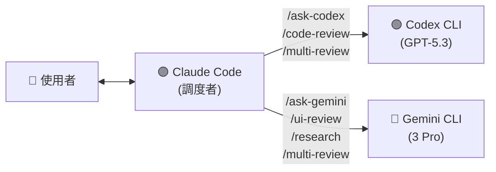

# claude-prism

[](https://opensource.org/licenses/MIT)
[](https://www.gnu.org/software/bash/)
[](https://claude.com/claude-code)

[English](README.md)

Claude Code 的跨 Provider AI 調度工具 — 消除同源盲點。

---

## 核心概念

### 問題

當 Claude Code 寫你的程式碼**同時也** review 它時，你會得到同源盲點。就像自己改自己的考卷——同一個模型有相同的知識缺口，某些類型的 bug、設計缺陷和安全問題會持續漏掉。

### 解法

讓 Claude Code 當**調度者**，把 review 和研究任務分派給 **Gemini** 和 **Codex**。三個不同的 AI provider、三組不同的訓練資料、三種不同的視角。

---

## 指令一覽

| 指令 | Provider | 說明 |
|------|----------|------|
| `/ask-codex` | Codex (GPT-5.3) | 直接提問 — 取得 OpenAI 觀點 |
| `/ask-gemini` | Gemini (3 Pro) | 直接提問 — 取得 Google 觀點 |
| `/code-review` | Codex | 跨 Provider 程式碼審查 |
| `/ui-review` | Gemini | UI/UX 無障礙與設計審查 |
| `/research` | Gemini | 結構化技術研究 |
| `/multi-review` | Codex + Gemini + Claude | 三方對抗式審查 |

### `/ask-codex` — 詢問 OpenAI

直接向 Codex (GPT-5.3) 提問，取得 OpenAI 的觀點。

```
/ask-codex React Query v5 中處理 optimistic updates 的最佳做法？
```

### `/ask-gemini` — 詢問 Google

直接向 Gemini (3 Pro) 提問，利用 Google 的生態廣度。

```
/ask-gemini 比較 Bun vs Deno vs Node.js 作為 2026 年新後端專案的選擇
```

### `/code-review` — 跨 Provider Code Review

Codex review Claude 寫的程式碼。核心用例——**不同 AI 寫、不同 AI 審**。

```
/code-review                    # review staged changes
/code-review src/auth.ts        # review 指定檔案
/code-review --diff             # review unstaged changes
/code-review --pr               # review 整個 PR
```

### `/ui-review` — UI/UX 審查

Gemini 審查前端程式碼的無障礙、響應式設計、元件結構和 UX 模式。

```
/ui-review src/components/Header.tsx
/ui-review src/app/(public)/
/ui-review --screenshot ./screenshot.png   # 改用 Claude 視覺分析
```

### `/research` — 技術研究

Gemini 進行結構化技術研究，包含比較表、推薦方案和學習資源。

```
/research Next.js App Router 最佳認證方案
/research Monorepo 工具比較：Turborepo vs Nx vs Moon
```

### `/multi-review` — 三方對抗式 Review

旗艦指令。同一份程式碼**同時**送給 Codex 和 Gemini，Claude 整合分析：

1. **共識區** — 雙方都指出的問題（高信心度，優先修復）
2. **分歧區** — 只有一方發現的問題（Claude 判斷有效性）
3. **Claude 補充** — 雙方都沒抓到但值得注意的問題

```
/multi-review                   # review staged changes
/multi-review --pr              # review 整個 PR
```

---

## 系統架構



### 運作原理

1. 使用者在 Claude Code 輸入 slash command（如 `/code-review src/auth.ts`）
2. Claude Code 讀取 command 定義（含指示的 Markdown）
3. Claude 讀取相關程式碼，組裝 prompt
4. Claude 透過 Bash tool 呼叫 shell script → script 調用外部 CLI
5. 外部 AI 處理請求並回傳結果
6. Claude 呈現結果，適時加入自己的觀點

---

## 技術棧

| 技術 | 用途 | 備註 |
|------|------|------|
| Bash | CLI 包裝腳本 | 負責 binary 偵測、logging、stdin 管線 |
| Markdown | Slash command 定義 | Claude Code 讀取這些檔案作為指令 |
| Claude Code | 調度者 | 讀取 command，分派至外部 CLI |
| Codex CLI | OpenAI 存取 | GPT-5.3 用於 code review 與 Q&A |
| Gemini CLI | Google 存取 | Gemini 3 Pro 用於研究、UI 審查、Q&A |

---

## 快速開始

### 前置需求

| 工具 | 必要性 | 安裝方式 |
|------|--------|----------|
| [Claude Code](https://claude.com/claude-code) | 必要 | `npm install -g @anthropic-ai/claude-code` |
| [Gemini CLI](https://github.com/google-gemini/gemini-cli) | Gemini 相關指令需要 | `npm install -g @google/gemini-cli` |
| [Codex CLI](https://github.com/openai/codex) | Codex 相關指令需要 | `npm install -g @openai/codex` |

### 安裝

```bash
git clone https://github.com/tznthou/claude-prism.git
cd claude-prism
./install.sh
```

安裝程式會：
- 檢查前置需求並回報可用狀態
- 覆寫前自動備份現有檔案
- 複製 commands 到 `~/.claude/commands/`，scripts 到 `~/.claude/scripts/`

### 驗證安裝

```bash
./tests/smoke-test.sh
```

### 移除

```bash
./uninstall.sh
```

---

## 專案結構

```
claude-prism/
├── commands/                   # Slash command 定義（Markdown）
│   ├── ask-codex.md
│   ├── ask-gemini.md
│   ├── code-review.md
│   ├── multi-review.md
│   ├── research.md
│   └── ui-review.md
├── scripts/                    # CLI 包裝腳本（Bash）
│   ├── call-codex.sh
│   └── call-gemini.sh
├── tests/
│   └── smoke-test.sh
├── install.sh
├── uninstall.sh
├── README.md
└── README.zh-TW.md
```

安裝後的位置：

```
~/.claude/
├── commands/                   # ← command 定義複製到此
├── scripts/                    # ← 包裝腳本複製到此
└── logs/
    └── multi-ai.log            # 呼叫紀錄（可稽核）
```

---

## 設定

### 環境變數

| 變數 | 預設值 | 說明 |
|------|--------|------|
| `GEMINI_MODEL` | `gemini-3-pro-preview` | 使用的 Gemini 模型 |
| `CODEX_MODEL` | `gpt-5.3-codex` | 使用的 Codex 模型 |
| `GEMINI_BIN` | （自動偵測） | Gemini 執行檔路徑 |
| `CODEX_BIN` | （自動偵測） | Codex 執行檔路徑 |
| `MULTI_AI_LOG_DIR` | `~/.claude/logs` | 紀錄檔目錄 |

### Script 功能

兩個包裝腳本都支援：

| 功能 | 說明 |
|------|------|
| **Binary 偵測** | 自動搜尋多個路徑找 CLI 執行檔 |
| **Logging** | 每次呼叫記錄到 `~/.claude/logs/multi-ai.log`（含時間戳） |
| **`--dry-run`** | 測試模式，不呼叫 API（不消耗 token） |
| **Stdin 管線** | `echo "code" \| call-gemini.sh "review"` 處理長輸入 |
| **Model 切換** | `-m model-name` 指定不同模型 |

### 自訂

**新增 Provider：**

1. 建立 `scripts/call-newprovider.sh`，參考現有 script 格式
2. 建立 `commands/ask-newprovider.md`，寫 command 定義
3. 執行 `./install.sh` 部署

**修改 Review Prompt：**

編輯 `commands/` 下的 `.md` 檔案，prompt 模板內嵌其中，直接改就好。

**輸出語言：**

Command 的 prompt 預設英文。要改成繁體中文輸出：

```diff
- "You are a Senior Code Reviewer. Review the following code."
+ "你是資深 Code Reviewer，用繁體中文 review 以下程式碼。"
```

---

## FAQ

**Q: Claude 真的有呼叫外部 CLI 嗎？還是自編自導？**

Logging 預設開啟，檢查 `~/.claude/logs/multi-ai.log` 即可驗證。每次呼叫都有時間戳、模型名稱和 prompt/response 長度。

**Q: 如果我只裝了 Gemini CLI？**

沒問題。需要 Codex 的指令（`/ask-codex`、`/code-review`）會顯示錯誤訊息。Gemini 相關指令（`/ask-gemini`、`/ui-review`、`/research`）正常運作。`/multi-review` 只會拿到一方觀點。

**Q: 費用多少？**

每個指令對外部 provider 發一次 API call，費用取決於你的 Gemini/OpenAI 計費方案。用 script 的 `--dry-run` 可以測試但不消耗 token。

**Q: 可以搭配其他 Claude Code 設定使用嗎？**

可以。Commands 和 scripts 是獨立的，只依賴 Claude Code 的 `~/.claude/` 目錄慣例。

---

## 授權

本專案採用 [MIT](LICENSE) 授權。

---

## 作者

**tznthou** — {email}
