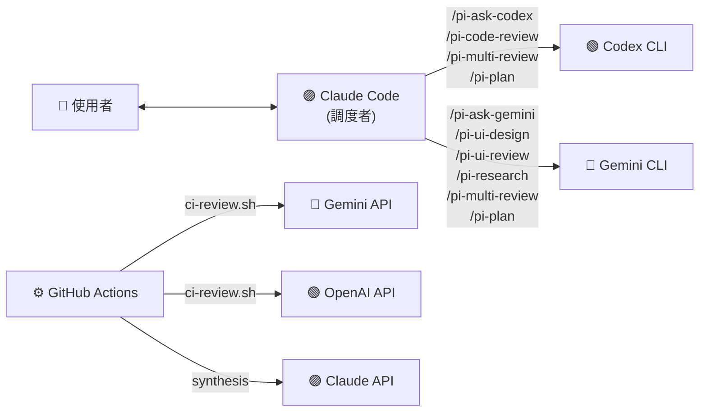
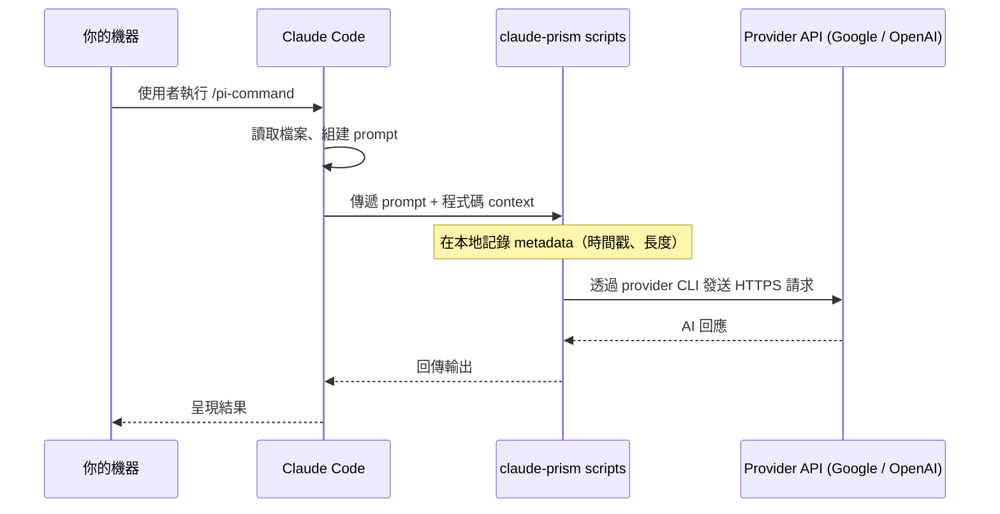

# claude-prism

<p align="center">
  
</p>

[](https://www.npmjs.com/package/claud-prism-aireview)
[](https://github.com/tznthou/homebrew-claude-prism)
[](https://opensource.org/licenses/MIT)
[](https://www.gnu.org/software/bash/)
[](https://claude.com/claude-code)
[](https://www.shellcheck.net/)

[English](README.md)

Claude Code 的跨 Provider AI 調度工具 — 消除同源盲點。

---

## 核心概念

### 問題

當 Claude Code 寫你的程式碼**同時也** review 它時，你會得到同源盲點。就像自己改自己的考卷——同一個模型有相同的知識缺口，某些類型的 bug、設計缺陷和安全問題會持續漏掉。

就算同一 provider 開多個 agent 來 review 也一樣：四個 Claude agent 仍然共享同一套訓練資料、同樣的架構偏好、同樣的知識截止點。更多 agent ≠ 更多觀點——如果底層模型有盲點，開再多分身也找不到那個 bug。

### 解法

讓 Claude Code 當**調度者**，把 review 和研究任務分派給 **Gemini** 和 **Codex**。三個不同的 AI provider、三組不同的訓練資料、三種不同的視角。這是**跨 Provider 審查調度**——在結構上就與同源多 agent 審查截然不同。

### 為什麼選 claude-prism？

| | claude-prism | 單一 Provider 多 Agent 審查 |
|---|---|---|
| **Provider 多樣性** | Codex + Gemini + Claude（3 個獨立模型） | 多個 agent，同一底層模型 |
| **盲點覆蓋** | 跨訓練資料：每個模型抓到其他模型漏掉的 | 同一訓練資料偏差在 agent 間放大 |
| **成本** | 近乎零（Codex CLI + Gemini CLI 免費額度） | 每 PR $15–25（官方工具，Team/Enterprise 方案） |
| **速度** | 1–2 分鐘 | ~20 分鐘 |
| **可用性** | 任何有 CLI 的人 | 僅限付費團隊方案 |
| **評分透明度** | [公開 spec](spec/confidence-scoring-v1.md)，deterministic，model-agnostic | 黑盒信心度評分 |

---

## 指令一覽

| 指令 | Provider | 說明 |
|------|----------|------|
| `/pi-ask-codex` | Codex | 直接提問 — 取得 OpenAI 觀點 |
| `/pi-ask-gemini` | Gemini | 直接提問 — 取得 Google 觀點 |
| `/pi-code-review` | Codex | 跨 Provider 程式碼審查（含信心度評分） |
| `/pi-ui-design` | Gemini | 從設計規格產生 HTML mockup |
| `/pi-ui-review` | Gemini | UI/UX 無障礙與設計審查（含信心度評分） |
| `/pi-research` | Gemini | 結構化技術研究 |
| `/pi-multi-review` | Codex + Gemini + Claude | 三方對抗式審查（智慧路由 + 信心度評分） |
| `/pi-plan` | Codex + Gemini + Claude | 產生結構化實作計畫 |

所有指令皆內建 **graceful degradation** — 若某個 provider 不可用，Claude 會用剩餘的 provider 繼續執行，而非直接失敗。

### `/pi-ask-codex` — 詢問 OpenAI

直接向 Codex 提問，取得 OpenAI 的觀點。

```
/pi-ask-codex React Query v5 中處理 optimistic updates 的最佳做法？
```

### `/pi-ask-gemini` — 詢問 Google

直接向 Gemini 提問，利用 Google 的生態廣度。

```
/pi-ask-gemini 比較 Bun vs Deno vs Node.js 作為 2026 年新後端專案的選擇
```

### `/pi-code-review` — 跨 Provider Code Review

Codex review Claude 寫的程式碼。核心用例——**不同 AI 寫、不同 AI 審**。

每個 issue 都會使用 [Confidence Scoring Framework](spec/confidence-scoring-v1.md) 打 0–100 分——evidence-based、deterministic 的雜訊過濾。只有 ≥ 80 分的 issue 會顯示。Review 同時檢查 inline annotation 合規性（`IMPORTANT`/`WARNING`/`TODO` 註解），`--pr` 模式下還會查詢同檔案的歷史 PR 評論，浮現反覆出現的問題。

```
/pi-code-review                    # review staged changes
/pi-code-review src/auth.ts        # review 指定檔案
/pi-code-review --diff             # review unstaged changes
/pi-code-review --pr               # review 整個 PR
```

### `/pi-ui-design` — 從設計規格產生 HTML Mockup

Gemini 讀取設計規格文件，產出可在瀏覽器預覽的自包含 HTML mockup（Tailwind CDN）。確認設計後再讓 Claude Code 實作到專案。

```
/pi-ui-design design-spec.md              # 從設計規格產生 HTML mockup
/pi-ui-design "一個 SaaS dashboard"        # 沒有設計檔 → Gemini 先產規格再產 mockup
```

### `/pi-ui-review` — UI/UX 審查

Gemini 審查前端程式碼的無障礙、響應式設計、元件結構和 UX 模式。Issue 使用 UI 專用信心度評分（WCAG 引用、使用者影響描述）。若專案有 `CLAUDE.md` 或 `Agents.md`，會自動檢查規範合規性。

```
/pi-ui-review src/components/Header.tsx
/pi-ui-review src/app/(public)/
/pi-ui-review --screenshot ./screenshot.png   # 改用 Claude 視覺分析
```

### `/pi-research` — 技術研究

Gemini 進行結構化技術研究，包含比較表、推薦方案和學習資源。若研究主題與當前專案相關，會自動帶入相關 context（依賴、既有模式）。研究結果可選擇存到 `.claude/pi-research/` 供日後參考。

```
/pi-research Next.js App Router 最佳認證方案
/pi-research Monorepo 工具比較：Turborepo vs Nx vs Moon
```

### `/pi-multi-review` — 三方對抗式 Review

旗艦指令。同一份程式碼**同時**送給 Codex 和 Gemini，Claude 整合分析：

1. **共識區** — 雙方都指出的問題（高信心度，優先修復）
2. **分歧區** — 只有一方發現的問題（Claude 判斷有效性）
3. **規範合規** — 違反 `CLAUDE.md` / `Agents.md` 專案規則的問題
4. **Claude 補充** — 雙方都沒抓到但值得注意的問題

**信心度評分**（[spec](spec/confidence-scoring-v1.md)）：所有 provider 的每個 issue 都會被打 0–100 分，基於**證據品質**而非 Claude 的觀點。只有 ≥ 80 分的 issue 會進入最終輸出。Base score 40，正面因子：具體行號（+25）、本次 diff 引入的程式碼（+25）、引用規則（+20）、可重現場景（+15）、多方共識（+20）。雜訊因子：主觀風格偏好（-25）、linter 可偵測（-25）、幻覺引用（-50）。此 framework 是 deterministic、model-agnostic 的[獨立標準](spec/confidence-scoring-v1.md)。

**智慧路由**（v0.7.0）：自動從檔案副檔名和路徑偵測改動的 domain（frontend/backend/fullstack）。合成時，domain 權威的 provider 享有更高權重——前端由 Gemini 主導（UI/UX 專長），後端由 Codex 主導（安全/演算法專長）。兩方 provider 都會被呼叫，權重只影響 Claude 如何處理分歧。

```
/pi-multi-review                   # review staged changes
/pi-multi-review --pr              # review 整個 PR
```

### `/pi-plan` — 結構化實作規劃

分析 codebase 並產生結構化計畫檔，可選諮詢 Codex 和 Gemini 取得獨立技術分析。

計畫存到 `.claude/pi-plans/`，包含：背景、多方分析、逐步實作步驟、關鍵檔案、風險和驗證標準。計畫檔跨 session 持久化。

```
/pi-plan 為 API 加入 JWT 認證
/pi-plan 重構支付模組以支援 Stripe
```

---

## 系統架構



### 運作原理

1. 使用者在 Claude Code 輸入 slash command（如 `/pi-code-review src/auth.ts`）
2. Claude Code 讀取 command 定義（含指示的 Markdown）
3. Claude 讀取相關程式碼，組裝 prompt
4. Claude 透過 Bash tool 呼叫 shell script → script 調用外部 CLI
5. 外部 AI 處理請求並回傳結果
6. Claude 呈現結果，適時加入自己的觀點
7. Review 指令會自動將結構化 insights 記錄到 `review-insights.jsonl` 以供趨勢分析

關於資料跨越信任邊界的細節，請參閱[隱私與資料流向](#隱私與資料流向)。

---

## 技術棧

| 技術 | 用途 | 備註 |
|------|------|------|
| Bash | CLI 包裝腳本 | 負責 binary 偵測、logging、stdin 管線 |
| Markdown | Slash command 定義 | Claude Code 讀取這些檔案作為指令 |
| Claude Code | 調度者 | 讀取 command，分派至外部 CLI |
| Codex CLI | OpenAI 存取 | Code review 與 Q&A（模型可設定） |
| Gemini CLI | Google 存取 | 研究、UI 審查、Q&A（模型可設定） |
| GitHub Actions | CI/CD 整合 | 自動化 PR review，透過 REST API |

---

## 快速開始

### 前置需求

| 工具 | 必要性 | 安裝方式 |
|------|--------|----------|
| [Claude Code](https://claude.com/claude-code) | 必要 | `npm install -g @anthropic-ai/claude-code` |
| [Gemini CLI](https://github.com/google-gemini/gemini-cli) | Gemini 相關指令需要 | `npm install -g @google/gemini-cli` |
| [Codex CLI](https://github.com/openai/codex) | Codex 相關指令需要 | `npm install -g @openai/codex` |

### 安裝

**快速安裝（推薦）**

```bash
npx claud-prism-aireview
```

**Homebrew (macOS)**

```bash
brew tap tznthou/claude-prism
brew install claud-prism-aireview
```

**手動安裝**

```bash
git clone https://github.com/tznthou/claude-prism.git
cd claude-prism
./install.sh
```

安裝程式會：
- 檢查前置需求並回報可用狀態
- 透過 SHA256 checksum 驗證檔案完整性（若有 `checksums.sha256`）
- 覆寫前自動備份現有檔案
- 複製 commands 到 `~/.claude/commands/`，scripts 到 `~/.claude/scripts/`

### 驗證安裝

```bash
./tests/smoke-test.sh
```

### 移除

```bash
npx claud-prism-aireview --uninstall
# 或手動：
./uninstall.sh
```

---

## 專案結構

```
claude-prism/
├── .github/workflows/
│   ├── ai-review.yml           # GitHub Actions CI review workflow
│   └── shellcheck.yml          # ShellCheck 靜態分析
├── spec/                       # 獨立規格文件
│   └── confidence-scoring-v1.md  # Evidence-based 雜訊過濾 framework
├── commands/                   # Slash command 定義（Markdown）
│   ├── pi-ask-codex.md
│   ├── pi-ask-gemini.md
│   ├── pi-code-review.md
│   ├── pi-multi-review.md
│   ├── pi-plan.md
│   ├── pi-research.md
│   ├── pi-ui-design.md
│   └── pi-ui-review.md
├── scripts/                    # CLI 包裝腳本與工具（Bash）
│   ├── call-codex.sh           # Codex CLI 包裝
│   ├── call-gemini.sh          # Gemini CLI 包裝
│   ├── detect-domain.sh        # 智慧路由 domain 偵測
│   ├── ci-review.sh            # CI/CD review 調度器（curl API）
│   ├── usage-summary.sh        # API 使用量統計
│   └── review-insights.sh      # Review 趨勢分析
├── tests/
│   └── smoke-test.sh
├── checksums.sha256            # SHA256 checksum 完整性驗證
├── install.sh
├── uninstall.sh
├── README.md
└── README.zh-TW.md
```

安裝後的位置：

```
~/.claude/
├── commands/                   # ← command 定義複製到此
├── scripts/                    # ← 包裝腳本複製到此
└── logs/
    ├── multi-ai.log            # 呼叫紀錄（時間戳、prompt/response 長度）
    └── review-insights.jsonl   # 結構化 review 歷史（自動記錄）

# /pi-plan 和 /pi-research 執行時建立：
.claude/pi-plans/               # ← 計畫檔（專案本地，跨 session 持久化）
.claude/pi-research/            # ← 研究結果存檔（可選）
```

---

## 設定

### 環境變數

| 變數 | 預設值 | 說明 |
|------|--------|------|
| `GEMINI_MODEL` | （CLI 預設） | 覆蓋 Gemini 模型（如 `gemini-3-pro-preview`） |
| `CODEX_MODEL` | （CLI 預設） | 覆蓋 Codex 模型（如 `gpt-5.3-codex`） |
| `GEMINI_BIN` | （自動偵測） | Gemini 執行檔路徑 |
| `CODEX_BIN` | （自動偵測） | Codex 執行檔路徑 |
| `MULTI_AI_LOG_DIR` | `~/.claude/logs` | 紀錄檔目錄 |

預設不指定模型，由各 CLI 使用內建預設值——零設定即可用。CLI 更新時自動使用最新模型。如需指定模型：

```bash
# Shell 設定檔（~/.zshrc 或 ~/.bashrc）
export GEMINI_MODEL="gemini-3-pro-preview"
export CODEX_MODEL="gpt-5.3-codex"

# 或單次呼叫時用 -m flag
~/.claude/scripts/call-gemini.sh -m gemini-3-flash-preview "your prompt"
```

### Script 功能

兩個包裝腳本都支援：

| 功能 | 說明 |
|------|------|
| **Binary 偵測** | 自動搜尋多個路徑找 CLI 執行檔 |
| **Logging** | 每次呼叫記錄到 `~/.claude/logs/multi-ai.log`（含時間戳） |
| **`--dry-run`** | 測試模式，不呼叫 API（不消耗 token） |
| **Stdin 管線** | `echo "code" \| call-gemini.sh "prompt"` 處理長輸入 |
| **Model 切換** | `-m model-name` 指定不同模型 |

### 自訂

**新增 Provider：**

1. 建立 `scripts/call-newprovider.sh`，參考現有 script 格式
2. 建立 `commands/ask-newprovider.md`，寫 command 定義
3. 執行 `./install.sh` 部署

**修改 Review Prompt：**

編輯 `commands/` 下的 `.md` 檔案，prompt 模板內嵌其中，直接改就好。

**輸出語言：**

Command 的 prompt 預設英文。要改成繁體中文輸出：

```diff
- "You are a Senior Code Reviewer. Review the following code."
+ "你是資深 Code Reviewer，用繁體中文 review 以下程式碼。"
```

---

## 可觀測性

### 使用量統計

追蹤 API 呼叫量和估算 token 消耗：

```bash
~/.claude/scripts/usage-summary.sh            # 今天
~/.claude/scripts/usage-summary.sh --week      # 過去 7 天
~/.claude/scripts/usage-summary.sh --all       # 全部
~/.claude/scripts/usage-summary.sh --date 2026-02-24  # 指定日期
```

輸出包含各 provider 呼叫次數、成功/失敗/dry-run 分佈、粗估 token 量（~4 字元/token）。

### Review 趨勢分析

每次 `/pi-code-review` 或 `/pi-multi-review` 後，Claude 會自動記錄結構化問題資料到 `~/.claude/logs/review-insights.jsonl`。分析歷史趨勢：

```bash
~/.claude/scripts/review-insights.sh              # 完整分析
~/.claude/scripts/review-insights.sh --recent 10  # 最近 10 次
~/.claude/scripts/review-insights.sh --project my-app  # 篩選專案
```

輸出包含：
- **分類分佈** — security、performance、design、logic 等（含長條圖）
- **嚴重度分佈** — critical / medium / suggestion
- **發現來源** — 共識 vs 單一 provider 發現
- **最常見問題** — 重複出現的模式會標記
- **近期 review 時間軸** — 最近 5 次 review 及問題數量

每筆 review 紀錄格式：

```json
{
  "date": "2026-02-24T10:30:00Z",
  "project": "my-app",
  "scope": "pr",
  "domain": "backend",
  "providers": ["codex", "gemini", "claude"],
  "issues": [
    {
      "category": "security",
      "severity": "critical",
      "confidence": 95,
      "title": "SQL injection in user input handler",
      "source": "consensus"
    }
  ]
}
```

分類：`security`、`performance`、`design`、`logic`、`maintainability`、`guideline`、`accessibility`、`other`。`guideline` 分類追蹤專案規範違規（`CLAUDE.md` / `Agents.md`）。

---

## CI/CD 整合

透過 GitHub Actions 自動化多方 provider PR review。CI 路徑直接使用 REST API（不需在 runner 上安裝 CLI）。

### 快速設定

1. 複製 workflow 檔案到你的專案：

```bash
mkdir -p .github/workflows
cp path/to/claude-prism/.github/workflows/ai-review.yml .github/workflows/
cp path/to/claude-prism/scripts/ci-review.sh scripts/
```

2. 在 GitHub Secrets 設定 API key（至少一個）：

| Secret | Provider | 必要？ |
|--------|----------|--------|
| `GEMINI_API_KEY` | Gemini review | 選配 |
| `OPENAI_API_KEY` | OpenAI review | 選配 |
| `ANTHROPIC_API_KEY` | Claude 綜合分析 | 選配 |

3. 在 PR 加上 `ai-review` label 即可觸發 review。

### 觸發模式

**Label 觸發（預設）：** 在 PR 加上 `ai-review` label → workflow 執行。適合控制成本。

**自動觸發：** 取消 workflow 檔案中 `pull_request: [opened, synchronize]` 區塊的註解 → 每次 PR 更新自動執行。

### CI 運作原理

1. GitHub Actions checkout PR 並取得 diff
2. `ci-review.sh` 自動偵測 `CLAUDE.md` / `Agents.md` 作為規範 context
3. 透過 GraphQL（單次 API 呼叫）查詢同檔案的歷史 PR 評論，作為反覆問題的 context
4. Diff 並行送給可用 provider（Gemini API、OpenAI API），含 inline annotation 合規檢查和 false positive 排除規則
5. 若有設定 `ANTHROPIC_API_KEY`，Claude 進行信心度評分綜合分析（只有 ≥ 80 分的 issue 會被貼出）
6. 若無，直接串接各方結果
7. 若 review 包含具體修正建議，會以 **inline PR review comment** 搭配 GitHub suggestion block 發佈（一鍵接受修改）。其餘內容作為 review body。若 Reviews API 不可用，退回一般 PR comment

### CI 環境變數

| 變數 | 預設值 | 說明 |
|------|--------|------|
| `GEMINI_MODEL` | `gemini-2.0-flash` | CI review 用的 Gemini 模型 |
| `OPENAI_MODEL` | `gpt-4o` | CI review 用的 OpenAI 模型 |
| `ANTHROPIC_MODEL` | `claude-sonnet-4-20250514` | 綜合分析用的 Claude 模型 |
| `MAX_DIFF_CHARS` | `32000` | Diff 截斷上限 |

### 安全注意事項

- **Fork PR**：Workflow 使用 `pull_request`（不是 `pull_request_target`），fork PR 無法存取你的 secrets。這是設計如此——fork PR 會被跳過。
- **API key**：使用 GitHub repository secrets，切勿將 API key commit 到 repo。
- **Concurrency**：同一 PR 同時只跑一個 review；新 push 會取消進行中的 review。
- **Checksums**：`checksums.sha256` 驗證檔案完整性，防止傳輸損壞或意外修改。但**無法**防禦 repo 本身被入侵——如需更強保護，請從 GitHub Release artifacts 頁面下載並比對。

### CLI 版本相容性

Wrapper scripts 依賴 CLI 的特定行為，這些行為不屬於官方穩定 API：

| CLI | 使用的行為 | 已驗證範圍 |
|-----|-----------|-----------|
| Gemini CLI | `-p " "` headless 模式（stdin + prompt） | v0.1.x – v0.3.x |
| Codex CLI | `codex exec - ` stdin 模式 | v0.100.x – v0.106.x |

若 CLI 更新導致功能異常，請固定使用已驗證版本或開 issue 回報。

---

## 成本估算

claude-prism 是本地端 wrapper——它本身不處理也不計費 token。每個指令可能透過 CLI 觸發一或多次外部 provider（Codex、Gemini）的 API 呼叫。Claude Code 自身的調度 token（讀取檔案、組建 prompt、合成結果）是獨立計算的，由你的 Claude 訂閱方案或 API 方案承擔。

### 各指令 Token 消耗

| 指令 | 外部呼叫 | 典型 Input Tokens | 典型 Output Tokens | 備註 |
|------|---------|-------------------|-------------------|------|
| `/pi-ask-codex` | 1 (Codex) | 500–2K | 500–2K | 隨問題複雜度增減 |
| `/pi-ask-gemini` | 1 (Gemini) | 500–2K | 500–2K | 隨問題複雜度增減 |
| `/pi-code-review` | 1 (Codex) | 2K–10K | 1K–4K | 隨 diff 大小增減 |
| `/pi-ui-review` | 1 (Gemini) | 2K–10K | 1K–4K | 隨檔案數量增減 |
| `/pi-ui-design` | 1 (Gemini) | 1K–3K | 3K–8K | 產出較重（HTML 生成） |
| `/pi-research` | 1 (Gemini) | 1K–3K | 2K–6K | 產出較重（結構化報告） |
| `/pi-multi-review` | 2 (Codex + Gemini) | 上述 ×2 | 上述 ×2 | 兩個 provider 並行呼叫 |
| `/pi-plan` | 0–2（可選） | 各 1K–5K | 各 1K–4K | 僅在 provider 可用時諮詢 |
Token 範圍為近似值，隨輸入大小（diff 長度、檔案數、問題複雜度）變動。不同 provider 使用不同的 tokenization 方法——這些數字是數量級估算，非帳單精確值。

### 控制成本

- **`--dry-run`** — 測試請求路徑但不呼叫 provider（不消耗 token）
- **`usage-summary.sh`** — 檢視歷史呼叫次數與粗估 token 用量：
  ```bash
  ~/.claude/scripts/usage-summary.sh --week
  ```
- **Provider 定價** — 至各 provider 定價頁面查詢目前費率：
  - [OpenAI API Pricing](https://openai.com/api/pricing/)
  - [Google AI Pricing](https://ai.google.dev/pricing)

---

## 隱私與資料流向

claude-prism 是本地端 Bash wrapper，不是託管式代理或中繼服務。你的機器和 AI provider 之間沒有任何中介伺服器。

### 資料流向



### 送出到外部 Provider 的內容

- 與指令相關的程式碼片段、diff 或檔案內容
- Claude Code 組建的 prompt（審查指令、context）
- 模型選擇 metadata（模型名稱、flags）

### 留在本地的內容

- **Log 檔**：`~/.claude/logs/multi-ai.log` 僅記錄 metadata（時間戳、prompt/response 位元組長度）——不含程式碼內容
- **Review 歷史**：`~/.claude/logs/review-insights.jsonl` 包含結構化的問題摘要（類別、嚴重度、信心度分數）——可能包含衍生自 AI 回應的問題標題
- **計畫與研究**：`.claude/pi-plans/` 和 `.claude/pi-research/` 檔案留在你的機器上
- **零遙測**：claude-prism 沒有分析服務、不會回傳資料、沒有中介伺服器

### 我們無法控制的部分

每個 provider 的資料處理方式由其自身的 API/商業條款規範，不受 claude-prism 控制：

- **資料保留** — provider 是否及保留你的 prompt/回應多久
- **模型訓練** — 你的資料是否被用於改善模型（API 條款通常排除此項，但請確認你的具體方案）
- **子處理者** — provider 使用的雲端基礎設施（AWS、Google Cloud、Azure）

Provider 條款：
- [Anthropic 商業條款](https://www.anthropic.com/policies/commercial-terms)
- [OpenAI API 條款](https://openai.com/policies/row-terms-of-use/)
- [Google AI 條款](https://ai.google.dev/gemini-api/terms)

> **合規或機密專案注意**：若你的程式碼受 HIPAA、SOC 2、NDA 或類似合規要求約束，請在將程式碼送至外部 API 前，確認完整鏈結——Claude Code 條款、provider API 條款、資料保留設定，以及你所屬組織的內部核准流程。

---

## FAQ

**Q: Claude 真的有呼叫外部 CLI 嗎？還是自編自導？**

Logging 預設開啟，檢查 `~/.claude/logs/multi-ai.log` 即可驗證。每次呼叫都有時間戳、模型名稱和 prompt/response 長度。

**Q: 如果我只裝了 Gemini CLI？**

沒問題。所有指令都內建 graceful degradation——若 provider 不可用，Claude 會用剩餘的 provider 繼續。`/pi-multi-review` 會使用 Claude + Gemini（兩方觀點取代三方）。`/pi-code-review` 會退回 Claude 獨立審查並加註同源盲點警告。

**Q: 如果 provider 回傳格式不符預期？**

Claude 會處理。若 Codex 或 Gemini 沒有按照要求的 emoji/score 格式回覆，Claude 會用語意比對從原始文字中提取可行動的問題。分數欄位在未提供時顯示「—」。

**Q: 費用多少？**

參閱[成本估算](#成本估算)段落，了解各指令的 token 消耗範圍和成本控制工具。

**Q: 可以搭配其他 Claude Code 設定使用嗎？**

可以。Commands 和 scripts 是獨立的，只依賴 Claude Code 的 `~/.claude/` 目錄慣例。

---

## 隨想

在 AI Coding 的時代，大部分開發者都會使用御三家（Claude、Codex、Gemini）的 CLI。我自己訂閱了 Claude Code 之後，就一直在想：既然已經有一個強大的 orchestrator 在手上，為什麼不能同時調度其他家的 CLI 來協助我完成更多事情？不管是 Code Review、技術研究，還是 UI/UX 設計，讓不同 AI 各自從不同角度切入，結果一定比單一來源更全面。

但我找了一圈，發現網路上現有的工具用起來都不太順手，不是太重、就是跟 Claude Code 的工作流整合得不好。所以我決定自己做一個。

本來只打算寫幾個簡單的 wrapper script，解決日常 review 的需求就好。沒想到做著做著，越來越多可能性冒出來：三方對抗式審查、review 趨勢分析、CI/CD 自動化⋯⋯這些方向都不在原本的計畫裡，但每一個都讓我覺得「欸，這好像真的有用」。

所以就變成了現在這個樣子。希望這個工具也能幫到你。

---

## 更新紀錄

完整版本歷史請見 [CHANGELOG.md](CHANGELOG.md)。

---

## 授權

本專案採用 [MIT](LICENSE) 授權。

---

## 作者

**tznthou** — [tznthou.com](https://tznthou.com) · [service@tznthou.com](mailto:service@tznthou.com)
