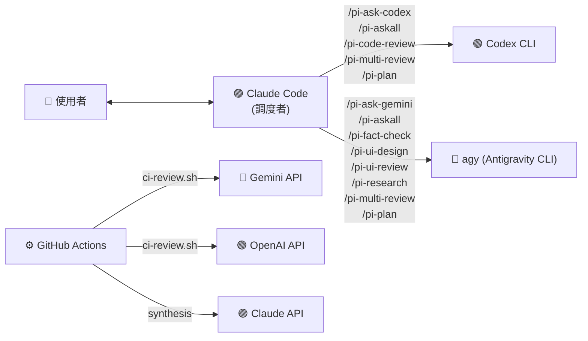
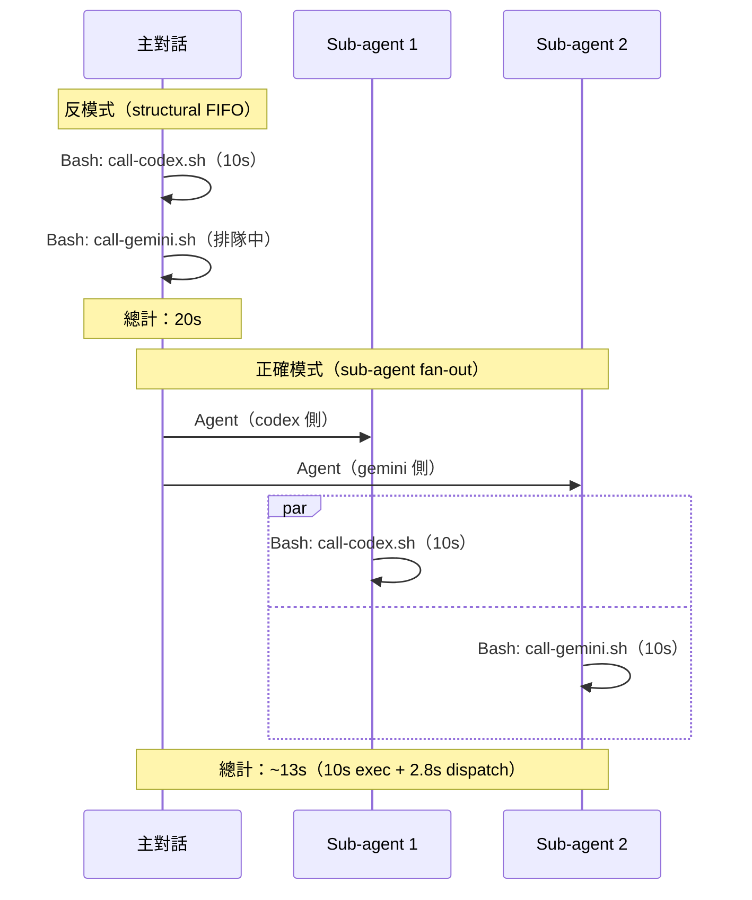

# claude-prism

<p align="center">
  
</p>

[](https://www.npmjs.com/package/claud-prism-aireview)
[](https://github.com/tznthou/homebrew-claude-prism)
[](https://opensource.org/licenses/MIT)
[](https://www.gnu.org/software/bash/)
[](https://claude.com/claude-code)
[](https://www.shellcheck.net/)
[](CODE_OF_CONDUCT.md)

[English](README.md)

Claude Code 的跨 Provider AI 調度工具 — 消除同源盲點。

---

## 核心概念

### 問題

AI code review 很吵。市場上最好的工具 F1 score 大概也才 64%——有相當比例的發現不是假警報就是漏網之魚。多數工具的解法是讓 AI 自己評估信心度（「我 90% 確定這是 bug」），但這就是自己改自己的考卷。

還有一個更深層的結構性問題：當 Claude Code 寫你的程式碼**同時也** review 它時，你會得到**同源盲點**。同一個模型有相同的知識缺口，某些類型的 bug、設計缺陷和安全問題會持續漏掉。就算開四個 Claude agent 來 review 也一樣，因為底層訓練資料和偏好都相同。更多 agent ≠ 更多觀點。

### 解法

**1. 跨 Provider 三角驗證**：Claude 負責調度，review 任務分派給 **Gemini** 和 **Codex**。三個 provider、三組訓練資料、三組互相抵消的盲點。

**2. 證據導向信心度評分**：不問 AI「你有多確定」，而是用可驗證的證據算分：具體行號（+25）、規則引用（+20）、可重現場景（+15）、幻覺引用（-50）。核心公式是 deterministic——同樣的證據永遠得到同樣的分數。[公開 spec](spec/confidence-scoring-v1.md)，沒有黑盒。

**3. Local-first**：程式碼直接送到各家 provider 的 API，中間沒有任何中繼伺服器、沒有第三方經手你的 code。

### 為什麼選 claude-prism？

| | claude-prism | 單一 Provider 多 Agent 審查 |
|---|---|---|
| **Provider 多樣性** | Codex + Gemini + Claude（3 個獨立模型） | 多個 agent，同一底層模型 |
| **盲點覆蓋** | 跨訓練資料：每個模型抓到其他模型漏掉的 | 同一訓練資料偏差在 agent 間放大 |
| **成本** | 近乎零（用現有 Codex CLI / Antigravity CLI 訂閱） | 每 PR $15–25（官方工具，Team/Enterprise 方案） |
| **速度** | 1–2 分鐘 | ~20 分鐘 |
| **可用性** | 任何有 CLI 的人 | 僅限付費團隊方案 |
| **評分方式** | 證據導向公式（[公開 spec](spec/confidence-scoring-v1.md)），deterministic 核心，同樣證據 = 同樣分數 | LLM 自評，AI 給自己打信心分數 |
| **資料路徑** | Local-first：直連 provider API，無中繼伺服器 | 依服務而異 |

### 與 `/ultrareview` 的比較（2026-04-16 發布）

Anthropic 在 2026-04-16 隨 Claude Opus 4.7 一起推出 [`/ultrareview`](https://code.claude.com/docs/en/ultrareview.md)——雲端 review，在遠端 sandbox 啟動一整批 Claude agent，每個發現都獨立驗證。相較單次 `/review` 是實質升級，但和 claude-prism 打的是不同的戰場：

| | claude-prism `/pi-multi-review` | `/ultrareview` |
|---|---|---|
| **模型多樣性** | Codex + Gemini + Claude（3 個獨立模型） | 多個 Claude agent，同一底層模型 |
| **盲點策略** | 異質訓練資料抵消共同盲區 | 同源——多跑幾次，盲區一樣 |
| **審查立場** | 對抗式，攻擊面分工 | 驗證導向（降低誤報率） |
| **免費額度** | 無上限（用現有 CLI 訂閱） | 每帳號終身 3 次，**用完不補** |
| **Team / Enterprise 免費次數** | 無上限 | 0 |
| **超過免費額度後** | 仍然無上限 | 每次約 $5–$20，計入 extra usage |
| **僅用 API key 的 Claude Code** | 可用 | 被擋（必須 Claude.ai 登入） |
| **Bedrock / Vertex / Foundry** | 可用（provider-agnostic） | 不支援 |
| **Zero Data Retention 組織** | 可用 | 被擋 |
| **CI/CD** | `ci-review.sh` 跑在 GitHub Actions | 僅限互動 session |

兩個工具優化的場景不同。`/ultrareview` 適合 Pro/Max 用戶在 Claude 生態內做 pre-merge 信心確認。`/pi-multi-review` 則是為那個圈子外的一切而生——CI pipeline、受法規/ZDR 管制的環境、沒有 Pro/Max 授權的團隊，以及任何想要「不共享 Claude 訓練資料的第三方觀點」的人。

### 為什麼信任這些發現？

多數 AI review 工具都用類似做法：讓 AI 對自己的發現打 0–100 信心分數，低於門檻就過濾。[Anthropic 官方 code review plugin](https://github.com/anthropics/claude-code/blob/main/plugins/code-review/README.md) 也使用 ≥80 門檻。問題是 LLM 產生的信心分數不穩定——同一份 review 跑兩次可能得到不同分數。

claude-prism 的 [Confidence Scoring Framework](spec/confidence-scoring-v1.md) 做法不同：用**可驗證的證據**打分，不靠 AI 自我評估。comment 有指出具體行號？+25。有引用 OWASP 規則？+20。提到一個不存在的檔案？-50。公式是 deterministic、model-agnostic 的，你可以打開 spec 驗證每一分怎麼來的。

---

## 快速開始

### 前置需求

| 工具 | 必要性 | 安裝方式 |
|------|--------|----------|
| [Claude Code](https://claude.com/claude-code) | 必要 | `npm install -g @anthropic-ai/claude-code` |
| [Antigravity CLI（`agy`）](https://github.com/google-antigravity/antigravity-cli) | Gemini 相關指令需要 | `curl -fsSL https://antigravity.google/cli/install.sh \| bash` |
| [Codex CLI](https://github.com/openai/codex) | Codex 相關指令需要 | `npm install -g @openai/codex` |

> **✅ Antigravity CLI 遷移（2026 年 6 月完成）**
>
> Google 在 I/O 2026 [宣布 Gemini CLI 由 Antigravity CLI 取代](https://developers.googleblog.com/an-important-update-transitioning-gemini-cli-to-antigravity-cli/)——`@google/gemini-cli` 已於 **2026-06-18** 停止服務 Google AI Pro、Ultra 與免費版 Code Assist 用戶。claude-prism 已在期限前完成遷移：`call-gemini.sh` 現在以非互動模式驅動 [`agy`](https://github.com/google-antigravity/antigravity-cli)，認證走 Google AI Pro OAuth。
>
> **不變的部分**：腳本檔名、`[gemini]` log tag、`GEMINI_MODEL` 模型覆蓋全部照舊——既有的 log 與指令不受影響。
>
> **改變的部分**：認證只走 OAuth（先執行一次 `agy` 完成登入；wrapper 不再讀取 `GEMINI_API_KEY`），執行檔路徑覆蓋改用 `AGY_BIN`（`GEMINI_BIN` 僅在指向 `agy` 執行檔時作為過渡別名接受）。如果機器上還裝著 `@google/gemini-cli`，它已不再被使用，可以解除安裝。

### 安裝

**快速安裝（推薦）**

```bash
npx claud-prism-aireview
```

一行完成下載與安裝——自動將 commands 部署到 `~/.claude/commands/`、scripts 到 `~/.claude/scripts/`。不使用 `postinstall` scripts，由你明確執行此指令。

**npm 全域安裝**

```bash
npm install -g claud-prism-aireview
claud-prism-aireview   # ← 必要步驟：將 commands 和 scripts 部署到 ~/.claude/
```

> **注意：** `npm install -g` 只會將執行檔放入 PATH，不會自動部署指令檔案。你必須手動執行一次 `claud-prism-aireview` 才能完成安裝。這是刻意的設計——我們不使用 `postinstall` scripts 以確保[供應鏈安全](docs/supply-chain-security.zh-TW.md)。

**Homebrew (macOS)**

```bash
brew tap tznthou/claude-prism
brew install claud-prism-aireview
```

**手動安裝**

```bash
git clone https://github.com/tznthou/claude-prism.git
cd claude-prism
./install.sh
```

安裝程式會檢查前置需求、透過 SHA256 checksum 驗證檔案完整性、覆寫前自動備份、然後將 commands 複製到 `~/.claude/commands/`、scripts 到 `~/.claude/scripts/`。

### 驗證安裝

```bash
./tests/smoke-test.sh
```

### 移除

```bash
npx claud-prism-aireview --uninstall
# 或手動：
./uninstall.sh
```

---

## 指令一覽

| 指令 | Provider | 說明 |
|------|----------|------|
| `/pi-ask-codex` | Codex | 直接提問 — 取得 OpenAI 觀點 |
| `/pi-ask-gemini` | Gemini | 直接提問 — 取得 Google 觀點 |
| `/pi-askall` | Codex + Gemini + Claude | 同時詢問所有 provider — 三方觀點 + 綜合分析 |
| `/pi-code-review` | Codex | 對抗式程式碼審查 — 打破信心而非驗證（含信心度評分） |
| `/pi-fact-check` | Gemini + WebSearch + Claude | 事實查核 — 雙軌搜尋（Gemini + WebSearch 同步），Claude 以收斂度評分驗證 |
| `/pi-ui-design` | Gemini | 從設計規格產生 HTML mockup |
| `/pi-ui-review` | Gemini | UI/UX 無障礙與設計審查（含信心度評分） |
| `/pi-research` | Gemini + WebSearch + Claude | 結構化技術研究 — 雙軌搜尋（Gemini + WebSearch 同步） |
| `/pi-multi-review` | Codex + Gemini + Claude | 三方對抗式審查 — 分工攻擊面（智慧路由 + 信心度評分） |
| `/pi-plan` | Codex + Gemini + Claude | 多方觀點實作規劃，適用於架構決策 |

所有指令皆內建 **graceful degradation** — 若某個 provider 不可用，Claude 會用剩餘的 provider 繼續執行，而非直接失敗。每次失敗都附帶**結構化錯誤診斷**（TIMEOUT、RATE_LIMIT、AUTH_ERROR、PERMISSION、SANDBOX、NETWORK、EMPTY_OUTPUT、CLI_ERROR 或 CLI_NOT_FOUND）並建議替代指令。

### `/pi-ask-codex` — 詢問 OpenAI

直接向 Codex 提問，取得 OpenAI 的觀點。

```
/pi-ask-codex React Query v5 中處理 optimistic updates 的最佳做法？
```

### `/pi-ask-gemini` — 詢問 Google

直接向 Gemini 提問，利用 Google 的生態廣度。

```
/pi-ask-gemini 比較 Bun vs Deno vs Node.js 作為 2026 年新後端專案的選擇
```

### `/pi-askall` — 詢問所有 Provider

同時向 Codex 和 Gemini 發送相同問題，Claude 綜合三方觀點。適用於**任何議題**——不限於程式碼。每個 provider 獨立回應（無交叉污染），Claude 比較共識、標記分歧、給出整合結論。

```
/pi-askall 新的微服務該用 monorepo 還是 polyrepo？
/pi-askall 協作編輯器的即時同步最佳方案？
```

### `/pi-fact-check` — 跨 Provider 事實查核

雙軌搜尋：Gemini（search grounding）與 WebSearch 同步執行，消除等待時間。Claude 獨立交叉驗證、URL 存在性檢查、以來源收斂度評分信心（多少獨立來源一致）。包含來源層級排名（L1 官方紀錄到 L6 社群）、同源報導去重、對抗性證據檢查。

```
/pi-fact-check article.md
/pi-fact-check https://example.com/blog-post
/pi-fact-check "特斯拉 2024 年交付 180 萬輛，市場佔有率超過 50%"
```

### `/pi-code-review` — 對抗式 Code Review

Codex 以**對抗式立場** review Claude 寫的程式碼——reviewer 的任務是打破你對這份改動的信心，而非驗證它。核心用例依然是**不同 AI 寫、不同 AI 審**，但 prompt 從中性的 "Senior Reviewer" 升級為 adversarial stance，定義了 9 類攻擊面（auth、data loss、race condition、rollback safety 等），每個 finding 必須回答四個問題：會出什麼問題、為什麼脆弱、影響多大、怎麼修。

每個 issue 都會使用 [Confidence Scoring Framework](spec/confidence-scoring-v1.md) 打 0–100 分——evidence-based、deterministic 的雜訊過濾。只有 ≥ 80 分的 issue 會顯示。Review 同時檢查 inline annotation 合規性（`IMPORTANT`/`WARNING`/`TODO` 註解），`--pr` 模式下還會查詢同檔案的歷史 PR 評論，浮現反覆出現的問題。

```
/pi-code-review                    # review staged changes
/pi-code-review src/auth.ts        # review 指定檔案
/pi-code-review --diff             # review unstaged changes
/pi-code-review --pr               # review 整個 PR
```

### `/pi-ui-design` — 從設計規格產生 HTML Mockup

Gemini 讀取設計規格文件，產出可在瀏覽器預覽的自包含 HTML mockup（Tailwind CDN）。確認設計後再讓 Claude Code 實作到專案。

```
/pi-ui-design design-spec.md              # 從設計規格產生 HTML mockup
/pi-ui-design "一個 SaaS dashboard"        # 沒有設計檔 → Gemini 先產規格再產 mockup
```

### `/pi-ui-review` — UI/UX 審查

Gemini 審查前端程式碼的無障礙、響應式設計、元件結構和 UX 模式。Issue 使用 UI 專用信心度評分（WCAG 引用、使用者影響描述）。若專案有 `CLAUDE.md` 或 `Agents.md`，會自動檢查規範合規性。

```
/pi-ui-review src/components/Header.tsx
/pi-ui-review src/app/(public)/
/pi-ui-review --screenshot ./screenshot.png   # 改用 Claude 視覺分析
```

### `/pi-research` — 技術研究

雙軌搜尋：Gemini（search grounding）和 WebSearch 同步執行，產出結構化技術研究報告，含比較表、推薦方案和來源 URL。任一軌道失敗時另一軌道自動補位——與 `/pi-fact-check` 相同的韌性架構。若研究主題與當前專案相關，會自動帶入相關 context（依賴、既有模式）。研究結果可選擇存到 `.claude/pi-research/` 供日後參考。

```
/pi-research Next.js App Router 最佳認證方案
/pi-research Monorepo 工具比較：Turborepo vs Nx vs Moon
```

### `/pi-multi-review` — 三方對抗式 Review（分工攻擊面）

旗艦指令。同一份程式碼**同時**送給 Codex 和 Gemini 進行**分工 adversarial review**——Codex 攻擊 security 與 data integrity（auth、data loss、race condition、schema drift 等 7 類），Gemini 攻擊 design、UX 與 maintainability（edge case UX、accessibility、abstraction leak、test coverage 等 7 類）。Claude 整合分析：

1. **共識區** — 雙方都指出的問題（高信心度，優先修復）
2. **分歧區** — 只有一方發現的問題（Claude 判斷有效性）
3. **規範合規** — 違反 `CLAUDE.md` / `Agents.md` 專案規則的問題
4. **Claude 補充** — 雙方都沒抓到但值得注意的問題

**信心度評分**（[spec](spec/confidence-scoring-v1.md)）：所有 provider 的每個 issue 都會被打 0–100 分，基於**證據品質**而非 Claude 的觀點。只有 ≥ 80 分的 issue 會進入最終輸出。Base score 40，正面因子：具體行號（+25）、本次 diff 引入的程式碼（+25）、引用規則（+20）、可重現場景（+15）、多方共識（+20）。雜訊因子：主觀風格偏好（-25）、linter 可偵測（-25）、幻覺引用（-50）。此 framework 是 deterministic、model-agnostic 的[獨立標準](spec/confidence-scoring-v1.md)。

**智慧路由**（v0.7.0）：自動從檔案副檔名和路徑偵測改動的 domain（frontend/backend/fullstack）。合成時，domain 權威的 provider 享有更高權重——前端由 Gemini 主導（UI/UX 專長），後端由 Codex 主導（安全/演算法專長）。兩方 provider 都會被呼叫，權重只影響 Claude 如何處理分歧。

```
/pi-multi-review                   # review staged changes
/pi-multi-review --pr              # review 整個 PR
```

### `/pi-plan` — 多方觀點實作規劃

適用於**有多條可行路徑**的任務——架構決策、技術選型、遷移策略。Claude 會先跟你確認可能改變方向的推斷（外部呼叫動輒數分鐘——理解偏差在前端攔截），再諮詢 Codex 和 Gemini 取得獨立架構分析，綜合成結構化計畫檔。Provider 意見分歧時，以 repo 實證優先於通用建議。

計畫存到 `.claude/pi-plans/`，包含：背景、範圍邊界、多方分析、逐步實作步驟、關鍵檔案、風險和驗證標準。計畫檔跨 session 持久化。

適合複雜決策；簡單的任務拆解請直接用 Claude Code 內建的 plan mode。

```
/pi-plan 從 REST 遷移到 GraphQL — 評估 Apollo vs Relay vs urql
/pi-plan 重構支付模組以支援多個支付商
```

---

## 系統架構


```mermaid
flowchart LR
    User["👤 使用者"] <--> Claude["🟣 Claude Code\n(調度者)"]
    Claude -->|"/pi-ask-codex\n/pi-askall\n/pi-code-review\n/pi-multi-review\n/pi-plan"| Codex["🟢 Codex CLI"]
    Claude -->|"/pi-ask-gemini\n/pi-askall\n/pi-fact-check\n/pi-ui-design\n/pi-ui-review\n/pi-research\n/pi-multi-review\n/pi-plan"| Gemini["🔵 agy (Antigravity CLI)"]
    CI["⚙️ GitHub Actions"] -->|"ci-review.sh"| GeminiAPI["🔵 Gemini API"]
    CI -->|"ci-review.sh"| OpenAIAPI["🟢 OpenAI API"]
    CI -->|"synthesis"| ClaudeAPI["🟣 Claude API"]
```

### 運作原理

1. 使用者在 Claude Code 輸入 slash command（如 `/pi-code-review src/auth.ts`）
2. Claude Code 讀取 command 定義（含指示的 Markdown）
3. Claude 讀取相關程式碼，組裝 prompt
4. 若指令需要同時呼叫兩個以上 provider，Claude 透過 **sub-agent fan-out** 分派（詳見下方[實證基礎](#實證基礎)）
5. 各 sub-agent 透過 Bash tool 呼叫 shell script → script 調用外部 CLI
6. 外部 AI 並行處理請求並回傳結果
7. Claude 呈現綜合結果，適時加入自己的觀點
8. Review 指令完成後，Claude 會解讀各 provider 的輸出（嚴重度、分類、來源），把結構化結果寫入 `review-insights.jsonl` 供日後趨勢分析

---

## 實證基礎

多數 AI 調度工具都宣稱「我們並行呼叫多個 provider」。我們用跨三層執行 context 的對照實驗驗證了這個宣稱在 Claude Code 裡是否真的成立——結果發現：**除非你為並行而設計，否則它不會自然發生**。

### 問題

當 Claude Code 在同一 message 裡發兩個 Bash tool call（`call-codex.sh` + `call-gemini.sh`），它們真的同時跑嗎？還是某一層其實有 queue？

### 對照實驗（N=36+）

五個實驗組對應三個候選假說（queue / provider contention / capacity）：

| 組 | 設定 | 驗證層級 |
|---|---|---|
| **A** | 主對話、同 message、2 個 Bash（Codex + Gemini） | 主對話層 queue |
| **B** | 主對話 → 2 個 sub-agent，各跑 1 個 CLI | sub-agent 層 queue |
| **B-hold15 / B-sleep / B-swap** | 變量隔離 | 拆掉 CLI / provider / 順序干擾 |
| **F** | 2 個 sub-agent，都跑 Gemini | 排除 provider 異質性 |
| **D** | 純 OS shell `&` fork | Claude Code 之下的 baseline |

### 結果 — 分層行為（MECE）

| 層級 | Queue 序列化 | Silence watchdog | Sleep guard | Auto-background |
|---|---|---|---|---|
| OS shell `&` fork | ❌ | ❌ | ❌ | ❌ |
| Sub-agent Bash | ❌（真並行） | ❓ 未測 | ✅ | 🔥 偶發 |
| **主對話 Bash** | ✅（同 message 內 FIFO） | ❌ | ❌ | ❌ |

- **A 層：N=7，`delta/first_exec` = 1.00 跨兩個 capacity window，每一次都精準吻合。** 最極端的一次：Codex 跑 150 秒，Gemini 的 invoke 時間戳跟 Codex 結束時間戳**精確到秒**地重合。零 variance。
- **B 層：N=13，dispatch delta 中位數 2.8 秒。** B-hold15 證實 Gemini 在 Codex 還在 `sleep 15` 時就正常 dispatch；B-sleep 證實 Codex 側完全沒跑 CLI，Gemini 照樣並行。
- **OS 層：N=6，delta ≈ 0 秒。** Claude Code 之下沒有任何限制。

### 對比圖 — 同樣的工作、不同的佈局


```mermaid
sequenceDiagram
    participant M as 主對話
    participant S1 as Sub-agent 1
    participant S2 as Sub-agent 2

    Note over M: 反模式（structural FIFO）
    M->>M: Bash: call-codex.sh（10s）
    M->>M: Bash: call-gemini.sh（排隊中）
    Note over M: 總計：20s

    Note over M,S2: 正確模式（sub-agent fan-out）
    M->>S1: Agent（codex 側）
    M->>S2: Agent（gemini 側）
    par
      S1->>S1: Bash: call-codex.sh（10s）
    and
      S2->>S2: Bash: call-gemini.sh（10s）
    end
    Note over M,S2: 總計：~13s（10s exec + 2.8s dispatch）
```

### 這為什麼重要

`pi-askall`、`pi-plan`、`pi-multi-review`、`pi-fact-check`——凡是會呼叫兩個以上 provider 的指令，都走 **sub-agent fan-out**，不在主對話直接發並行 Bash。這不是架構偏好，是**唯一能在 Claude Code 的 structural FIFO 下拿到真並行的執行層**。

完整摘要、分層資料、產品決策 trace：[docs/research/bash-tool-parallelism.md](docs/research/bash-tool-parallelism.md)（英文）。

---

## 技術棧

| 技術 | 用途 | 備註 |
|------|------|------|
| Bash | CLI 包裝腳本 | 負責 binary 偵測、logging、stdin 管線 |
| Markdown | Slash command 定義 | Claude Code 讀取這些檔案作為指令 |
| Claude Code | 調度者 | 讀取 command，透過 sub-agent fan-out 分派 |
| Codex CLI | OpenAI 存取 | Code review 與 Q&A（模型可設定） |
| agy（Antigravity CLI） | Google 存取 | 研究、UI 審查、Q&A（模型可設定） |
| GitHub Actions | CI/CD 整合 | 自動化 PR review，透過 REST API |

## 專案結構

```
claude-prism/
├── .github/
│   ├── dependabot.yml          # Dependabot 版本更新（github-actions 每週）
│   └── workflows/
│       ├── ai-review.yml       # Label 觸發 CI review
│       ├── release.yml         # npm OIDC 發布 + GitHub Release
│       ├── shellcheck.yml      # ShellCheck 靜態分析
│       └── traffic-stats.yml   # GitHub traffic 資料收集（每週）
├── docs/                       # 深度文件（見下方延伸閱讀）
├── spec/                       # 獨立規格文件
│   └── confidence-scoring-v1.md  # Evidence-based 雜訊過濾 framework
├── commands/                   # Slash command 定義（Markdown）
├── scripts/                    # CLI 包裝腳本與工具（Bash）
│   ├── call-codex.sh           # Codex CLI 包裝（含 soft-timeout）
│   ├── call-gemini.sh          # agy（Antigravity CLI）包裝（含 soft-timeout）
│   ├── detect-domain.sh        # 智慧路由 domain 偵測
│   ├── analyze-log.sh          # 呼叫生命週期診斷
│   ├── ci-review.sh            # CI/CD review 調度器（curl API）
│   ├── calibrate-timeout.sh     # Per-skill timeout 校準器（p99-based）
│   ├── usage-summary.sh        # API 使用量統計
│   └── review-insights.sh      # Review 趨勢分析
├── tests/smoke-test.sh
├── checksums.sha256            # SHA256 checksum 完整性驗證
├── install.sh / uninstall.sh
├── README.md / README.zh-TW.md
└── CHANGELOG.md
```

安裝後的位置：

```
~/.claude/
├── commands/                   # ← command 定義複製到此
├── scripts/                    # ← 包裝腳本複製到此
└── logs/
    ├── multi-ai-YYYY-MM.log    # 呼叫紀錄，月度輪替（v0.14.4+）
    ├── multi-ai.log            # Symlink → 當月 log 檔
    └── review-insights.jsonl   # 結構化 review 歷史（自動記錄）
```

---

## 設定

### 環境變數

| 變數 | 預設值 | 說明 |
|------|--------|------|
| `GEMINI_MODEL` | （CLI 預設） | 覆蓋 Gemini 模型（如 `gemini-3-flash-preview`），透過 `agy --model` 傳遞 |
| `CODEX_MODEL` | （CLI 預設） | 覆蓋 Codex 模型（如 `gpt-5.3-codex`） |
| `AGY_BIN` | （自動偵測） | `agy` 執行檔路徑 |
| `GEMINI_BIN` | — | `AGY_BIN` 的過渡別名（已棄用）；僅在指向 `agy` 執行檔時接受，並寫入 WARN log |
| `CODEX_BIN` | （自動偵測） | Codex 執行檔路徑 |
| `MULTI_AI_LOG_DIR` | `~/.claude/logs` | 紀錄檔目錄 |
| `CLAUDE_PRISM_TIMEOUT`（v0.14.0+） | `110` | Soft-timeout 掛鐘時限（整數秒，範圍 1..3600）。無效值自動 fallback 到 110 並寫入 WARN log。超時時 wrapper 會發出 rc=124 + stderr sentinel + `soft_timeout` log event，取代原本被 Claude Code harness 在 130 秒附近悄悄 SIGKILL 的黑洞。已知會跑比較久的任務可以 per-invocation 調寬：`CLAUDE_PRISM_TIMEOUT=180 ./call-codex.sh "40KB review prompt"` |

預設不指定模型，由各 CLI 使用內建預設值——零設定即可用。如需指定模型：

```bash
# Shell 設定檔（~/.zshrc 或 ~/.bashrc）
export GEMINI_MODEL="gemini-3-flash-preview"
export CODEX_MODEL="gpt-5.3-codex"

# 或單次呼叫時用 -m flag
~/.claude/scripts/call-gemini.sh -m gemini-3-flash-preview "your prompt"
```

### Script 功能

兩個包裝腳本都支援：

| 功能 | 說明 |
|------|------|
| **Streaming 輸出** | CLI 回應透過 `tee` 即時串流到 stdout，不做 buffering |
| **SIGHUP 防禦** | Script 忽略 `SIGHUP`，背景化時不會被終止 |
| **背景化 Fallback** | 每次呼叫的輸出各自寫到 `mktemp` 檔（v0.14.2+，byte-sync）。Sub-agent fan-out skills（`pi-askall` / `pi-plan` / `pi-multi-review`）傳 `$CLAUDE_PRISM_OUT_TMP` 取得 caller-owned 隔離 OUT_TMP（v0.14.3+，解 cross-session race）；direct skills 仍讀 shared `pi-{codex,gemini}-last.out` symlink 做 empty-stdout fallback（legacy best-effort） |
| **Binary 偵測** | 自動搜尋多個路徑找 CLI 執行檔 |
| **Logging** | 每次呼叫記錄到 `~/.claude/logs/multi-ai.log`（含時間戳） |
| **`--dry-run`** | 測試模式，不呼叫 API（不消耗 token） |
| **Stdin 管線** | `echo "code" \| call-gemini.sh "prompt"` 處理長輸入 |
| **Model 切換** | `-m model-name` 指定不同模型 |
| **Soft-timeout**（v0.14.0+） | Provider CLI 呼叫被 `CLAUDE_PRISM_TIMEOUT` 掛鐘限制（預設 110 秒，範圍 1..3600）。超時時結構化退出：rc=124、stderr sentinel、`soft_timeout` log event 讓 `analyze-log.sh` 歸類為 SOFT_TIMEOUT——比 Claude Code ~130 秒的 harness watchdog 更早觸發 |

### 自訂

**新增 Provider：** 建立 `scripts/call-newprovider.sh` 和 `commands/ask-newprovider.md`（參考現有格式），執行 `./install.sh` 部署。

**修改 Review Prompt：** 編輯 `commands/` 下的 `.md` 檔案，prompt 模板內嵌其中。

---

## 延伸閱讀

所有「安裝與使用」之外的細節都放在 [`docs/`](docs/)：

| 主題 | English | 繁體中文 |
|---|---|---|
| 可觀測性 — 使用量統計、review 趨勢、呼叫生命週期、快取 TTL | [docs/observability.md](docs/observability.md) | [docs/observability.zh-TW.md](docs/observability.zh-TW.md) |
| CI/CD 整合 — GitHub Actions workflow、CI 環境變數、安全注意事項 | [docs/ci-cd.md](docs/ci-cd.md) | [docs/ci-cd.zh-TW.md](docs/ci-cd.zh-TW.md) |
| 成本估算 — 各指令 token 範圍、成本控制工具 | [docs/cost.md](docs/cost.md) | [docs/cost.zh-TW.md](docs/cost.zh-TW.md) |
| 供應鏈安全 — 免 `postinstall` 設計、防禦層級、自行驗證 | [docs/supply-chain-security.md](docs/supply-chain-security.md) | [docs/supply-chain-security.zh-TW.md](docs/supply-chain-security.zh-TW.md) |
| 隱私與資料流向 — 送出什麼、留在本地什麼、Provider 條款 | [docs/privacy.md](docs/privacy.md) | [docs/privacy.zh-TW.md](docs/privacy.zh-TW.md) |
| 隨想 — 設計筆記與心得 | [docs/reflections.md](docs/reflections.md) | [docs/reflections.zh-TW.md](docs/reflections.zh-TW.md) |
| 研究 — sub-agent fan-out 設計背後的 Bash tool 分層研究 | [docs/research/bash-tool-parallelism.md](docs/research/bash-tool-parallelism.md) | — |
| [Confidence Scoring Framework](spec/confidence-scoring-v1.md) | normative spec | — |
| [CHANGELOG](CHANGELOG.md) | 版本歷史 | — |

---

## FAQ

**Q: Claude 真的有呼叫外部 CLI 嗎？還是自編自導？**

Logging 預設開啟，檢查 `~/.claude/logs/multi-ai.log` 即可驗證。每次呼叫都有時間戳、模型名稱和 prompt/response 長度。

**Q: 如果我只裝了其中一個 provider 的 CLI？**

沒問題。所有指令都內建 graceful degradation 和**結構化錯誤診斷**——若 provider 不可用，失敗訊息會包含具體原因（TIMEOUT、RATE_LIMIT、AUTH_ERROR、PERMISSION、SANDBOX、NETWORK、EMPTY_OUTPUT、CLI_ERROR 或 CLI_NOT_FOUND）並建議替代指令。`/pi-multi-review` 和 `/pi-askall` 會使用 Claude + 可用的 provider（兩方觀點取代三方）。`/pi-code-review` 會退回 Claude 獨立審查並加註同源盲點警告，同時建議改用 `/pi-multi-review`。`/pi-fact-check` 和 `/pi-research` 都採用雙軌搜尋（Gemini + WebSearch 同步）；若兩者皆失敗才退至 Claude 訓練資料。

**Q: 如果 provider 回傳格式不符預期？**

Claude 會處理。若 Codex 或 Gemini 沒有按照要求的 emoji/score 格式回覆，Claude 會用語意比對從原始文字中提取可行動的問題。分數欄位在未提供時顯示「—」。

**Q: 費用多少？**

參閱 [docs/cost.zh-TW.md](docs/cost.zh-TW.md) 了解各指令的 token 消耗範圍和成本控制工具。

**Q: Gemini provider 一直 timeout 或回應很慢？**

很可能是 Pro 模型限流。設定 `GEMINI_MODEL="gemini-3-flash-preview"`——Flash 更快，coding benchmark 分數也更高（SWE-bench：Flash 78% vs Pro 76.2%）。如果症狀是空輸出而不是慢，先互動式執行一次 `agy` 確認登入狀態——`agy` 遇到部分認證與網路錯誤時會以正常結束碼回傳空輸出，wrapper 會將其分類為 `EMPTY_OUTPUT` / `AUTH_ERROR`。

**Q: 可以搭配其他 Claude Code 設定使用嗎？**

可以。Commands 和 scripts 是獨立的，只依賴 Claude Code 的 `~/.claude/` 目錄慣例。

**Q: 隱私政策 / 供應鏈安全細節在哪？**

[docs/privacy.zh-TW.md](docs/privacy.zh-TW.md) 與 [docs/supply-chain-security.zh-TW.md](docs/supply-chain-security.zh-TW.md)。

---

## 貢獻指南

歡迎貢獻！不論是 bug 修復、新 provider 整合、prompt 改善，還是文件修正——請參閱我們的[貢獻指南](CONTRIBUTING.md)開始。

本專案遵循 [Contributor Covenant 行為準則](CODE_OF_CONDUCT.md)，參與即代表你同意遵守。

**快速連結：**

- [開發環境設定](CONTRIBUTING.md#getting-started)
- [程式碼標準](CONTRIBUTING.md#code-standards)（Bash 3.2+、ShellCheck、conventional commits）
- [提交 PR](CONTRIBUTING.md#submitting-changes)
- [回報問題](CONTRIBUTING.md#reporting-issues)

---

## 致謝

`/pi-fact-check` 一開始有參考 [newtype-os](https://github.com/newtype-01/newtype-os) 的 `super-fact-checker` 方法論（作者是我很喜歡的 YouTuber）。後來覺得直接搬別人的框架不太對，就整個砍掉重寫了，加入跨 provider 驗證、對抗性證據這些我們自己的東西。但起點的功勞還是值得大書特書的。

---

## 授權

本專案採用 [MIT](LICENSE) 授權。

---

## 作者

**tznthou** — [tznthou.com](https://tznthou.com) · [service@tznthou.com](mailto:service@tznthou.com)
