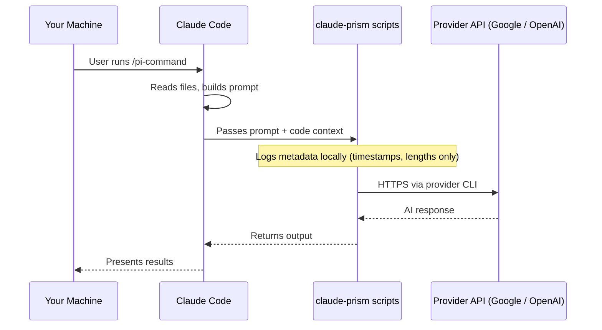

# Privacy & Data Flow

claude-prism is a local Bash wrapper, not a hosted proxy or relay service. There is no intermediary server between your machine and the AI providers.

[繁體中文](privacy.zh-TW.md) · [← Back to README](../README.md)

---

## Data Flow

## What Gets Sent to External Providers

- Code snippets, diffs, or file contents relevant to your command
- The prompt assembled by Claude Code (review instructions, context)
- Model selection metadata (model name, flags)

## What Stays Local

- **Logs**: `~/.claude/logs/multi-ai.log` records metadata only (timestamps, prompt/response byte lengths) — no code content
- **Review history**: `~/.claude/logs/review-insights.jsonl` — one structured JSON line per review. Each record is Claude's interpretation of the providers' output (category, severity, confidence, source, and an issue title derived from the AI response), not a raw transcript
- **Provider CLI output** (v0.14.2+): `~/.claude/logs/pi-{codex,gemini}-last-XXXXXX` holds the raw provider response per invocation, one file per call. `pi-{codex,gemini}-last.out` is a symlink that always points to the latest. These files contain the **full response body**, not metadata — if your prompt carried sensitive code you'd rather not retain, delete them manually after the review. **Cross-session caveat**: the symlink is one shared stable pointer per provider; if you run two Claude Code sessions on the same machine and both invoke the same provider concurrently, a fallback `cat` on the symlink may land on the other session's response. Not a data leak to third parties, but it is cross-session within your own machine — worth knowing when handling unrelated confidential contexts in parallel
- **Plans and research**: `.claude/pi-plans/` and `.claude/pi-research/` files stay on your machine
- **No telemetry**: claude-prism has no analytics, no phone-home, no intermediary server

## What We Don't Control

Each provider's data handling is governed by their own API/business terms, not by claude-prism:

- **Data retention** — whether and how long providers store your prompts/responses
- **Model training** — whether your data is used to improve their models (API terms typically exclude this, but verify your specific tier)
- **Sub-processors** — the cloud infrastructure providers use (AWS, Google Cloud, Azure)

Provider terms:
- [Anthropic Commercial Terms](https://www.anthropic.com/policies/commercial-terms)
- [OpenAI API Terms](https://openai.com/policies/row-terms-of-use/)
- [Google AI Terms](https://ai.google.dev/gemini-api/terms)

> **For regulated or confidential projects**: If your codebase is subject to HIPAA, SOC 2, NDA, or similar compliance requirements, verify the full chain — Claude Code terms, provider API terms, data retention settings, and your organization's internal approval process — before sending code to external APIs.
