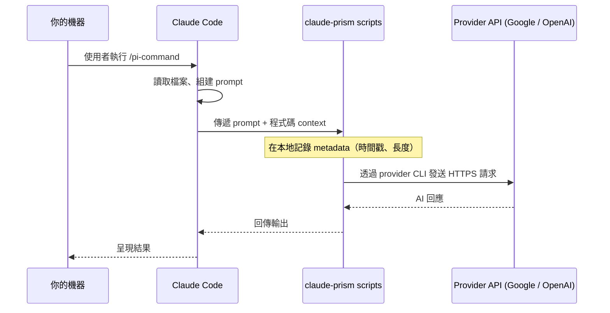

# 隱私與資料流向

claude-prism 是本地端 Bash wrapper，不是託管式代理或中繼服務。你的機器和 AI provider 之間沒有任何中介伺服器。

[English](privacy.md) · [← 返回 README](../README.zh-TW.md)

---

## 資料流向

## 送出到外部 Provider 的內容

- 與指令相關的程式碼片段、diff 或檔案內容
- Claude Code 組建的 prompt（審查指令、context）
- 模型選擇 metadata（模型名稱、flags）

## 留在本地的內容

- **Log 檔**：`~/.claude/logs/multi-ai.log` 僅記錄 metadata（時間戳、prompt/response 位元組長度）——不含程式碼內容
- **Review 歷史**：`~/.claude/logs/review-insights.jsonl`——每次 review 一行結構化 JSON。每筆紀錄是 Claude 對 provider 輸出的解讀（類別、嚴重度、信心度、發現來源，以及衍生自 AI 回應的問題標題），不是原始 transcript
- **Provider CLI 輸出**（v0.14.2+）：`~/.claude/logs/pi-{codex,gemini}-last-XXXXXX` 是每次呼叫的 provider 原始回應，一次呼叫一個檔案。`pi-{codex,gemini}-last.out` 是 symlink，永遠指向最新那次。這些檔案**存的是完整回應內容**，不是 metadata——如果你送出的 prompt 含敏感程式碼、不想留在硬碟上，review 結束後請自行刪除。**跨 session 提醒**：symlink 是單一共享指標（每個 provider 一個），若你同一台機器開兩個 Claude Code session 同時打同一個 provider，某次 fallback `cat` symlink 可能讀到另一個 session 的回應。這不會流到第三方，但在你自己機器上的 session 之間可能交叉——處理兩個無關但都機密的 context 時要留意
- **計畫與研究**：`.claude/pi-plans/` 和 `.claude/pi-research/` 檔案留在你的機器上
- **零遙測**：claude-prism 沒有分析服務、不會回傳資料、沒有中介伺服器

## 我們無法控制的部分

每個 provider 的資料處理方式由其自身的 API/商業條款規範，不受 claude-prism 控制：

- **資料保留** — provider 是否及保留你的 prompt/回應多久
- **模型訓練** — 你的資料是否被用於改善模型（API 條款通常排除此項，但請確認你的具體方案）
- **子處理者** — provider 使用的雲端基礎設施（AWS、Google Cloud、Azure）

Provider 條款：
- [Anthropic 商業條款](https://www.anthropic.com/policies/commercial-terms)
- [OpenAI API 條款](https://openai.com/policies/row-terms-of-use/)
- [Google AI 條款](https://ai.google.dev/gemini-api/terms)

> **合規或機密專案注意**：若你的程式碼受 HIPAA、SOC 2、NDA 或類似合規要求約束，請在將程式碼送至外部 API 前，確認完整鏈結——Claude Code 條款、provider API 條款、資料保留設定，以及你所屬組織的內部核准流程。
