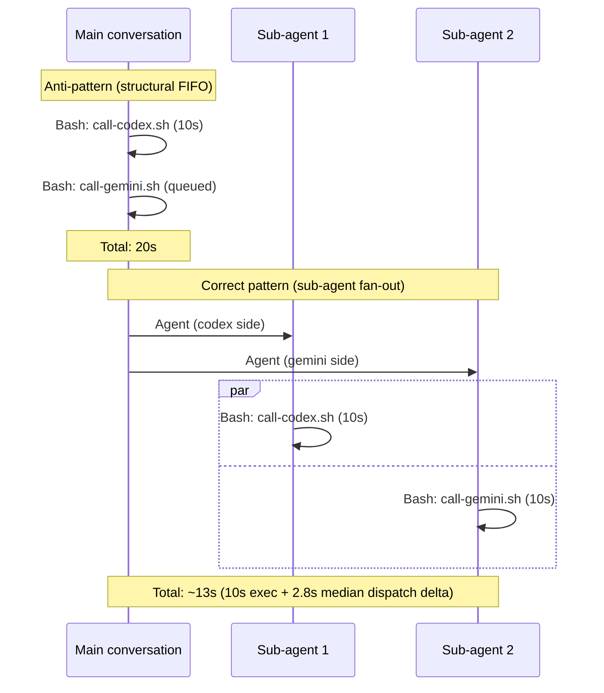

# Bash Tool Parallelism in Claude Code: Research Summary

> Summary of a multi-day controlled study behind claude-prism's sub-agent fan-out architecture. Full methodology, per-run data, and meta-reflections are being prepared as a separate write-up.

[← Back to README](../../README.md) · [Observability](../observability.md)

---

## The question

When Claude Code dispatches two Bash tool calls "in parallel" (same message, two `call-*.sh` invocations to different providers), do they actually run concurrently? Or is there a hidden queue somewhere?

Whether `pi-askall`, `pi-plan`, `pi-multi-review`, `pi-fact-check` — every command that calls two or more providers — can deliver concurrency depends entirely on this answer.

## The incident that started it

A `pi-plan` session that should have taken ~60 seconds took **17 minutes 35 seconds**. Gemini's `tool_result` returned as a 195-byte placeholder (`Command running in background with ID: ...`) while the actual script was still retrying. Dual-track fallback caught the degradation, but the signature needed understanding — a single observation had at least three candidate root causes, all producing identical shapes.

## Three hypotheses, mutually confusable on single data points

| Hypothesis | Predicted observation | Implication if true |
|---|---|---|
| **H_queue** | Any two parallel Bash calls serialize; `delta ≈ first_exec` | Claude Code is the bottleneck; multi-provider CLI must route through sub-agents |
| **H_provider** | Only heterogeneous providers slow; same-provider or no-CLI paths are parallel | Issue is local runtime contention; transport change fixes it |
| **H_capacity** | Only fires under Gemini high-load windows | Pure Gemini-side issue; client-side needs timeout hardening |

Single-point observation cannot separate them. Each produces the same apparent shape.

## Methodology in one paragraph

Five experimental groups (A main-conv / B sub-agent / C c+c / F g+g / D OS shell baseline) ran across two capacity windows (Gemini low-load and high-load). Four companion groups (B-hold15, B-sleep, B-swap, baseline-g) isolated specific variables: hold `first_exec` constant, remove the CLI transport entirely, reverse dispatch order, establish single-path noise floor. Each run captures 5 timestamps from sub-agent jsonl and `multi-ai.log`. Total: N=36+ runs over three time windows, one machine, identical scripts.

## The result (MECE by execution layer)

| Layer | Queue Serialize | Long-silence Watchdog | Sleep Pattern Guard | Auto-background |
|---|---|---|---|---|
| OS shell `&` fork | ❌ | ❌ | ❌ | ❌ |
| Sub-agent Bash | ❌ (true parallel) | ❓ untested | ✅ (built-in policy) | 🔥 suspected, rare |
| **Main-conversation Bash** | ✅ (same-message FIFO) | ❌ | ❌ | ❌ |

**Group A (main-conv): N=7, `delta/first_exec` = 1.00 across every single run, two capacity windows.** The cleanest signature: Codex executed for 150 seconds, Gemini's invoke timestamp aligned with Codex's end timestamp to the second. Zero variance. This FIFO is **structural**, not capacity-dependent, not provider-dependent.

**Group B (sub-agent): N=13, median dispatch delta 2.8s, range 1.1–7.9s.** B-hold15 proved Gemini dispatches *while Codex is still in `sleep 15`*. B-sleep proved Gemini dispatches with no Codex CLI present at all. Sub-agent Bash is genuinely parallel.

**Group D (OS shell): N=6, delta = 0s every run.** No constraint below Claude Code.

**Group F capacity-bad: 1/7 hit a SIGKILL + placeholder outlier.** Non-deterministic; reproducing it requires actual Gemini API peak load (not merely the US business-hours window).

## Anti-pattern vs correct pattern

## Product decisions traced back to the data

1. **Sub-agent fan-out is the only layer that delivers concurrency.** `pi-askall`, `pi-plan`, `pi-multi-review`, and `pi-fact-check` dispatch via sub-agents, not direct parallel Bash. That's not a style preference — it's the only architecture that doesn't hit Group-A FIFO.

2. **Asymmetric commit** (Codex primary blocking, Gemini optional auditor) hedges against the Group-F outlier pattern. Individual providers can still get caught by the auto-background path; the design must degrade gracefully rather than block.

3. **Fire-and-Forget + polling rejected.** We shipped a version with `run_in_background=true` + tee-file polling (v0.12.3 era), hit race conditions and stdin pipe deadlocks, rolled back. This study's data reinforced the rollback decision: Claude Code has hidden auto-background downgrade paths that polling cannot reliably detect.

4. **Script-layer soft timeout (v0.14.0).** Main-conversation + sub-agent queue/dispatch layers are now well-characterized; the highest-ROI remaining hardening is at script layer — wall-clock soft timeout inside `call-*.sh` that fires *before* Claude Code's ~130s harness watchdog, producing a structured rc=124 + log event instead of silent SIGKILL. Shipped as `CLAUDE_PRISM_TIMEOUT`. See [Observability → Invocation Diagnostics](../observability.md#invocation-diagnostics) for the resulting `SOFT_TIMEOUT` classification.

## Methodological lessons (short form)

- **Structural phenomena require relative-match consistency, not absolute values in isolation.** Variance tails always coincidentally match some exec time, producing false FIFO signatures. If we had stopped at N=1, we would have reached the opposite conclusion and designed the product wrong.
- **Variable isolation beats multivariate sampling.** Four companion groups totaling 12 runs were more decisive than "same condition N=20 pattern-hunt."
- **Same-window same-machine is a hard constraint.** N from different capacity windows cannot be pooled; capacity load adds to exec variance.
- **Raw timestamps > aggregated verdicts.** The analyzer's verdict (parallel/FIFO/gray) is a lossy summary; truth lives in the relative positions of the 5 timestamps.

## Open problems

1. **Mechanism B (long-silence auto-background) trigger conditions remain unmapped.** 18 runs in high-load window didn't reproduce. Actual threshold likely needs real Gemini API peak load + specific prompt patterns combined.
2. **Context × capacity coupling.** The original 17-minute incident used a large planning prompt; study runs used short prompts. Whether context payload size is a contributing trigger is untested at scale.
3. **Fan-out count scaling.** B-swap confirms 2-agent symmetry, but whether 3+ agents hit dispatch-level FIFO is untested.

## Version context

macOS Darwin 25.4.0 · claude-prism v0.12.6 (study) / v0.14.0 (publication) · Gemini CLI pro tier · Codex CLI default model.

---

*Full experimental design, per-run data tables, the history of rejected working hypotheses, and meta-reflections on methodology will appear in a longer-form write-up.*
